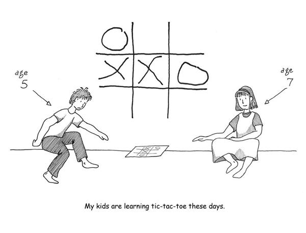

# Prologue: My Grandfather

# Prologue: My Grandfather

My grandfather wanted to know whether I felt proud of what I do. It seemed a reasonable question: there he was, aging and soon to pass away, though at the time I didn’t know that; a man who had spent his life as a fire chief, raising six children. One of them followed in his footsteps, became a fire chief himself, and now sells bathtub linings. There’s a special education teacher, an architect, a carpenter. Good, solid wholesome professions for good, solid wholesome people. And there I was—making games rather than contributing to society.

I told him that I felt I did contribute. Games aren’t just a diversion; they’re something valuable and important. And my evidence was right in front of me—my kids, playing tic-tac-toe on the floor.

Watching my kids play and learn through playing had been a revelation for me. Even though my profession was making games, I often felt lost in the complexities of making large modern entertainment products rather than understanding why games are fun and what fun is.

My kids were leading me, without my quite knowing it, toward a theory of fun. And so I told my grandfather, “Yes, this is something worthwhile. I connect people, and I teach people.” But as I said it, I didn’t really have any evidence to offer.

[*OceanofPDF.com*](https://oceanofpdf.com)
