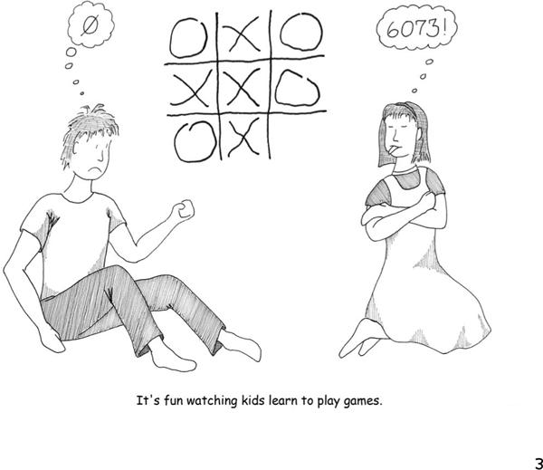
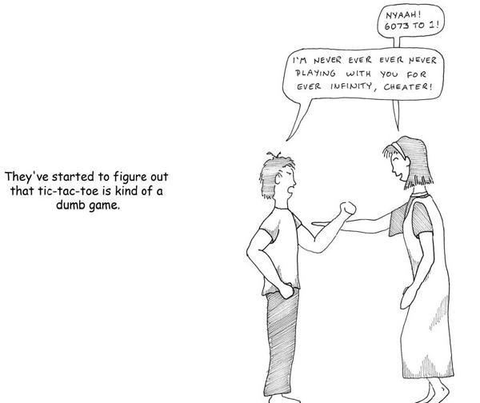
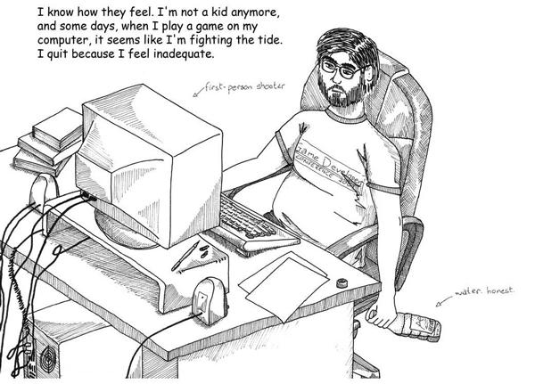
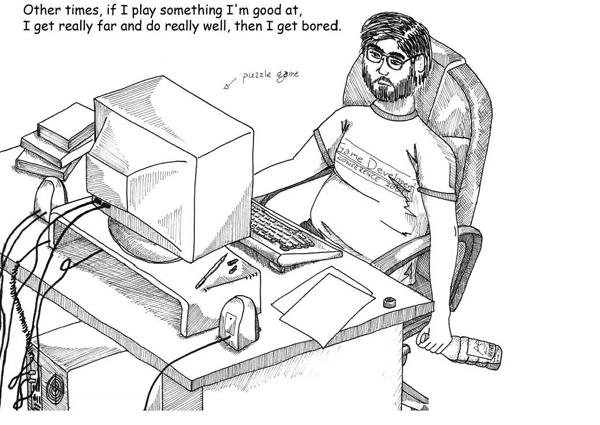
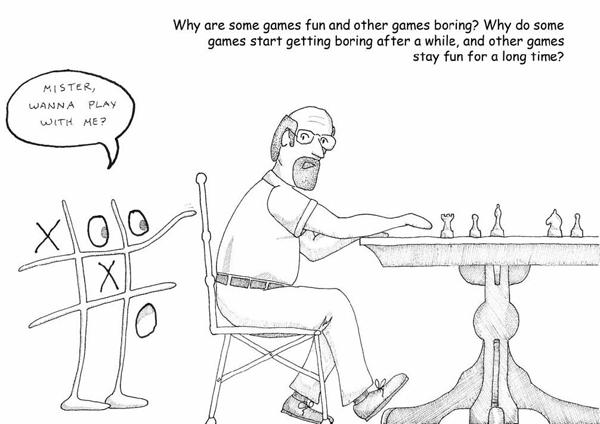

# 1. Why Write This Book?

# Chapter 1. Why Write This Book?

Our kids took to games at a very early age. Games were all around them, and I brought home a crazy amount of them because of my work. I suppose it’s no surprise that children model their parents. But my wife and I are also voracious readers, and the kids were resistant to that. Their attraction to games was more instinctive. As babies, they found the game of hide-the-object to be endlessly fascinating, and even now that they are older it elicits an occasional giggle. As babies there was an intentness about their alien gaze as they tried to figure out where the rubber duckie had gone that showed that this game was, for them, in deadly earnest.

Kids are playing everywhere, all the time, and often playing games that we do not quite understand. They play and learn at a ferocious rate. We see the statistics on how many words kids absorb in a day, how rapidly they develop motor control, and how many basic aspects of life they master—aspects that are frankly so subtle that we have even forgotten learning them—and we usually fail to appreciate what an amazing feat this is.

Consider how hard it is to learn a language, and yet children all over the world do it routinely. A *first* language. They are doing it without assigning cognates in their native tongue and without translating in their heads. Recently much attention has been paid to some very special deaf kids in Nicaragua, who have managed to invent a fully functional sign language in just a few generations. Many believe this shows language is built into the brain and that there’s something in our wiring that guides us inexorably toward language.

Language is not the only hardwired behavior. As babies move up the developmental ladder, they take part in a variety of instinctual activities. Any parent who has suffered through the “terrible twos” can tell you that it’s as if a switch went on in their child’s brain, altering their behavior radically. (It lasts longer than just the age of two, by the way—just a friendly warning.)

Kids also move on from certain games as they age. It’s been particularly interesting to see my kids outgrow tic-tac-toe—a game I beat them at for years until one day all the matches became draws.

That extended moment when tic-tac-toe ceased to interest them was a moment of great fascination to me. Why, I asked myself, did mastery and understanding come so suddenly? The kids weren’t able to tell me that tic-tac-toe is a limited game with optimal strategy. They saw the pattern, but they did not *understand* it, as we think of things.

This isn’t unfamiliar to most people. I do many things without fully understanding them, even things I feel I have mastered. I don’t need a degree in automotive engineering to drive my car. I don’t need to remember the ins and outs of the rules of grammar to speak grammatically in everyday conversation. I don’t need to know whether tic-tac-toe is NP-hard or NP-complete to know that it’s a dumb game.

I also have plenty of experiences where I stare at something and simply don’t get it. I hate to admit it, but my typical reaction is to simply turn away. I feel this way often these days now that there’s some (OK, a lot of) gray at my temples. I find myself unable to relate to some of the games that everyone tells me I should be playing. I just can’t move the mouse quite as fast as I used to. I’d rather not play than feel that inept, even if the other players are friends of mine.

That’s not just me saying, “I can’t cut it in Internet play! Damn 14-year-old kids.” My reaction isn’t mere frustration; it’s also got a tinge of boredom. I look at the problem and say, “Well, I could take on the Sisyphean task of trying to match these guys, but frankly, repeated failure is a predictable cycle, and rather boring. I have better things to do with my time.”

From everything I hear, this feeling is likely to increase as I age. More and more novel experiences are going to come along, until sometime in 2038 when I’ll need the assistance of my smart-ass grandkid to flibber-jibber the frammistan because I won’t be able to cope with the newfangled contraptions.

Is this inevitable?

When I work on games that are more my speed, I can still crush them (mu ha ha ha). We read all the time about people who play *Scrabble* or other mentally challenging games delaying the onset of Alzheimer’s. Surely keeping the mind active keeps it flexible and keeps you young?

Games don’t last forever, though. There just comes a point where you say, “You know, I think I’ve seen most everything that this game has to offer.” This happened to me most recently with a typing game I found on the Internet—it was a cute game where I played a diver and sharks were trying to eat me. Each shark had a word on their side, and as I typed the words in, the sharks went belly-up.

Now, I am a terrible formal typist, but I can hunt-and-peck at almost 100 words a minute. This game was fun, but it was also a piece of cake. After level 12 or 14, the game just gave up. It conceded. It said to me, “You know, I’ve tried every trick I can think of, including words with random punctuation in the middle, words spelled backwards, and not showing you the words until the last minute. So hell with it; from now on, I’ll just keep throwing the same challenges at you. But really, you can quit now, because you’ve seen all I’ve got.”

I took its advice, and quit.

Games that are too hard kind of bore me, and games that are too easy *also* kind of bore me. As I age, games move from one to the other, just as tic-tac-toe did for our children. Sometimes I play games with people who crush me and afterwards explain kindly, “Well, you see, this is a game about vertices.” And I say, “Vertices? I’m putting down pieces on a board!” And they shrug, as if to say I’ll never get it.

That’s why I decided to tackle the questions of what games are, and what fun is, and why games matter. I knew I’d be going over well-trod ground—a fair amount of psychological literature has been written on developmental behaviors in kids, for example. But the fact is that we don’t tend to take games all that seriously.

As I write this a lot of people happen to be exploring these questions. Games, in their digital form, have become big business. We see ads for them on TV, we debate whether or not they make more money than the movie industry (the answer is no, right now, by the way), and we agonize over whether they cause violence in our children. Games are now a major cultural force. The time is ripe for us to dig deeper into the many questions that games raise.

I also find it curious that as parents, we’ll insist that kids be given the time to play because it’s important to childhood, but that work is deemed far more important later in life. I think work and play aren’t all that different, to be honest. And what follows is why I came to that conclusion.

