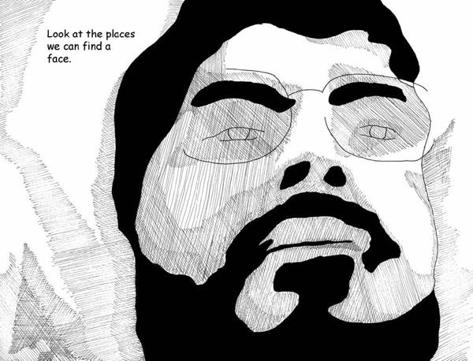
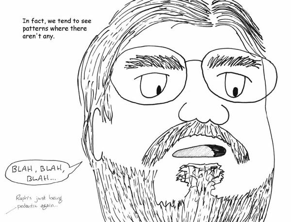
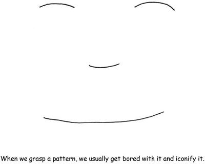
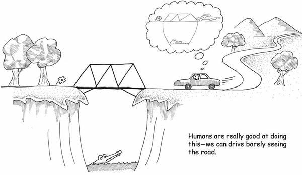
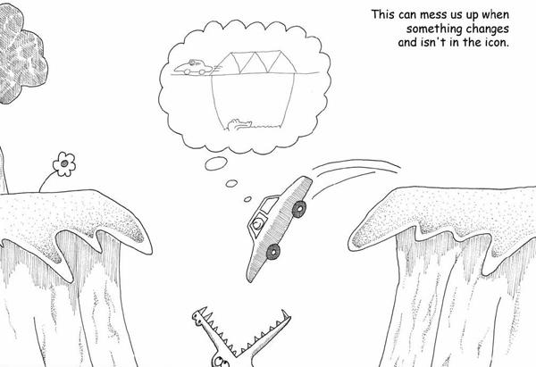
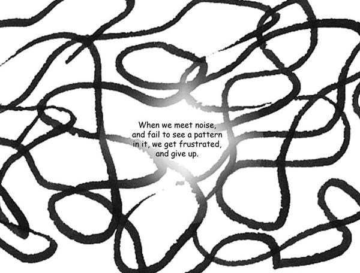
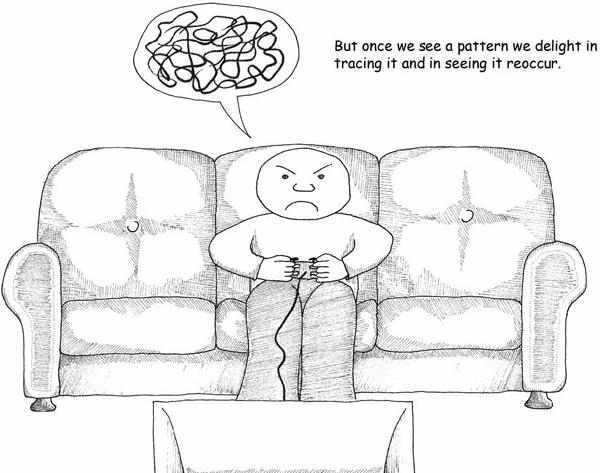
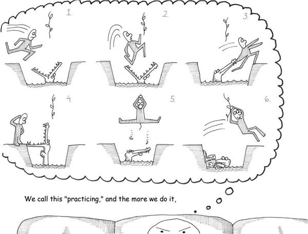
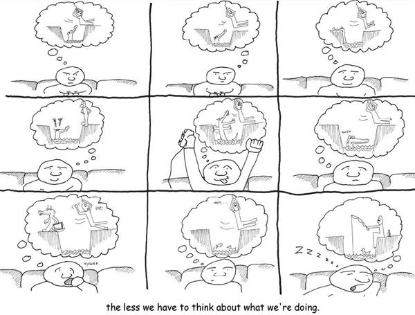
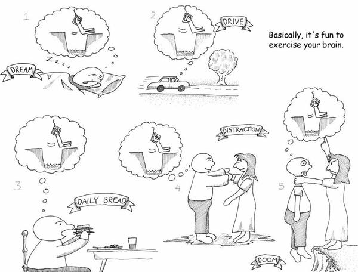

# 2. How the Brain Works

# Chapter 2. How the Brain Works

There are a lot of definitions of “game” out there.

There’s a field called “game theory,” which has something to do with games, a lot to do with psychology, even more to do with math, and not a lot to do with game design. Game theory is about how competitors make optimal choices, and it’s mostly used in politics and economics, where it is frequently proven wrong.

Looking up “game” in the dictionary isn’t that helpful. Once you leave out the definitions referring to hunting, they wander all over the place. Pastimes or amusements are lumped in with contests. Interestingly, none of the definitions tend to assume that fun is a requirement: amusement or entertainment at best is required.

Those few academics who tried to define “game” have offered up everything from Roger Caillois’s “activity which is…voluntary…uncertain, unproductive, governed by rules, make-believe” to Johan Huizinga’s “free activity…outside ‘ordinary’ life…” to Jesper Juul’s more contemporary and precise take: “A game is a rule-based formal system with a variable and quantifiable outcome, where different outcomes are assigned different values, the player exerts effort in order to influence the outcome, the player feels attached to the outcome, and the consequences of the activity are optional and negotiable.”

None of these help designers find “fun,” though.

Game designers themselves offer a bewildering and often contradictory set of definitions.

* To Chris Crawford, outspoken designer and theorist, games are a subset of entertainment limited to conflicts in which players work to foil each other’s goals, just one of many leaves off a tree that includes playthings, toys, challenges, stories, competitions, and a lot more.
* Sid Meier, designer of the classic *Civilization* computer games, gave a classic definition of “a series of meaningful choices.”
* Ernest Adams and Andrew Rollings, authors of *Andrew Rollings and Ernest Adams on Game Design*, narrow this further to “one or more causally linked series of challenges in a simulated environment.”
* Katie Salen and Eric Zimmerman say in their book *Rules of Play* that a game is “a system in which players engage in an artificial conflict, defined by rules, that results in a quantifiable outcome.”

This feels like a quick way to get sucked into quibbling over the classification of individual games. Many simple things can be made complex when you dig into them, but having fun is something so fundamental that surely we can find a more basic concept?

I found my answer in reading about how the brain works. Based on my reading, the human brain is mostly a voracious consumer of patterns, a soft pudgy gray Pac-Man of concepts. Games are just exceptionally tasty patterns to eat up.

When you watch a kid learn, you see there’s a recognizable pattern to what they do. They give it a try once—it seems that a kid can’t learn by being taught. They have to make mistakes themselves. They push at boundaries to test them and see how far they will bend. They watch the same video over and over and over and over and over and over…

Seeing patterns in how kids learn is evidence of how pattern-driven our brains are. We pattern-seek the process of pattern-seeking! Faces may be the best example. How many times have you seen faces in wood grain, in the patterns in plaster walls, or in the smudges on the sidewalk? A surprisingly large part of the human brain is devoted to seeing faces—when we look at a person’s face, a huge amount of brainpower is expended in interpreting it. When we’re not looking at someone face-to-face, we often misinterpret what they mean because we lack all the information.

The brain is hardwired for facial recognition, just as it is hardwired for language, because faces are incredibly important to how human society works. The capability to see a face in a collection of cartoony lines and interpret remarkably subtle emotions from them is indicative of what the brain does best.

Simply put, the brain is made to fill in blanks. We do this so much we don’t even realize we’re doing it.

Experts have been telling us for a while now that we’re not really “conscious” in the way that we think we are; we do most things on autopilot. But autopilot only works when we have a reasonably accurate picture of the world around us. Our noses really ought to be blocking a lot of our view, but when we cross our eyes, our brains have magically made our nose invisible. What the heck has the brain managed to put in its place? The answer, oddly, is an *assumption*—a reasonable construct based on the input from both eyes and what we have seen before.

Assumptions are what the brain is best at. Some days, I suspect that makes us despair.

There’s a whole branch of science dedicated to figuring out how the brain knows what it does. It’s already led to a wonderful set of discoveries.

We’ve learned that if you show someone a movie with a lot of jugglers in it and tell them in advance to count the jugglers, they will probably miss the large pink gorilla in the background, even though it’s a somewhat noticeable object. *The brain is good at cutting out the irrelevant*.

We’ve also found that if you get someone into a hypnotic trance and ask them to describe something, they will often describe much more than if they were asked on the street. *The brain notices a lot more than we think it does*.

We now know that when you ask someone to draw something, they are far more likely to draw the generalized iconic version of the object that they keep in their head than they are to draw the actual object in front of them. In fact, seeing what is actually there with our conscious mind is really hard to do, and most people never learn how to do it! *The brain is actively hiding the real world from us*.

These things fall under the rubric of “cognitive theory,” a fancy way of saying “how we think we know what we think we know.” Most of them are examples of a concept called “chunking.”

Chunking is something we do all the time.

If I asked you to describe how you got to work in the morning in some detail, you’d list off getting up, stumbling to the bathroom, taking a shower, getting dressed, eating breakfast, leaving the house, and driving to your place of employment. That seems like a good list, until I ask you to walk through exactly how you perform just one of those steps. Consider the step of getting dressed. You’d probably have trouble remembering all the stages. Which do you grab first, tops or bottoms? Do you keep your socks in the top or second drawer? Which leg do you put in your pants first? Which hand touches the button on your shirt first?

Odds are good that you could come to an answer if you thought about it. This is called a morning routine because it *is* routine. You rely on doing these things on autopilot. This whole routine has been “chunked” in your brain, which is why you have to work to recall the individual steps. It’s basically a recipe that is burned into your neurons, and you don’t “think” about it anymore.

Whatever “thinking” means.

We’re usually running on these automatic chunked patterns. In fact, most of what we see is also a chunked pattern. We rarely look at the real world; we instead recognize something we have chunked, and leave it at that. The world could easily be composed of cardboard stand-ins for real objects as far as our brains are concerned. One might argue that the essence of much of art is forcing us to see things as they are rather than as we assume them to be—poems about trees that force us to look at the majesty of bark and the subtlety of leaf, the strength of trunk and the amazing abstractness of the negative space between boughs—those are getting us to ignore the image in our head of “wood, big greenish, whatever” that we take for granted.

When something in a chunk does not behave as we expect it to, we have problems. It can even get us killed. If cars careen sideways on the road instead of moving forward as we expect them to, we no longer have a rapid response routine. And sadly, conscious thought is really inefficient. If you have to think about what you’re doing, you’re more liable to screw up. Your reaction times are orders of magnitude slower and odds are good you’ll get in a wreck.

How we live in a world of chunking is fascinating. Maybe you’re reading this and feeling uncomfortable about whether you’re really reading this. But what I really want to talk about is how chunks and routines are built in the first place.

People dislike chaos. We like order—not regimented order, but order with a bit of *texture* or variation to it. For example, there’s a long tradition in art history of observing that many paintings use a system of order called *the golden section*, which is basically just a way of dividing up the space on the painting into boxes of different proportions. It turns out that doing so makes the painting appear “prettier” to us.

This isn’t exactly a revelation to anyone in the arts. Excess chaos just doesn’t have pop appeal. We call it “noise,” “ugly,” or “formless.” My music teacher in college said, “Music is ordered sound and silence.” “Ordered” is a pretty important word in that sentence.

There’s some highly ordered music that doesn’t appeal to most of us either. A lot of folks say that the strain of jazz known as bebop is just noise. But I’m going to offer up an alternate definition of noise: *Noise is any pattern we don’t understand*.

Even static has patterns to it. If the little black and white dots are the output of random numbers, they have the pattern of the output of random number generators—a complex pattern, but a pattern nonetheless. If you happen to know the algorithm used to generate the number, and the seed from which the algorithm started, you could exactly replicate that static. There’s really next to nothing in the visible universe that is patternless. If we perceive something as noise, it’s most likely a failure in ourselves, not a failure in the universe.

The first time you hear jazz it may sound weird to you, especially if you’ve been reared on good old-fashioned “three chords and the truth” rock ‘n’ roll. It’ll be “devil music,” to borrow a term from countless exasperated parents who railed against their kids’ choice of music.

If you get past your initial distaste (which may last only a fraction of a second), you may come to see the patterns inherent in it. For example, you’ll spot the flattened fifth that is so important to a jazzy sound. You’ll start drumming your fingers to the expected 4/4 beat and find to your dismay that it’s actually 7/8 or some other meter. You’ll be at sea for a bit, but you may experience a little thrill of delight once you *get it* and experience a moment of discovery, of joy.

If jazz happens to interest you, you’ll sink into these patterns and come to expect them. If you get really into it, you may come to feel that a musical style such as alternating-bass folk music is hopelessly “square.”

Congratulations, you just chunked up jazz. (Hmm, I hope that doesn’t sound too disgusting!)

That doesn’t mean you are done with jazz, though. There’s a long way to go between intellectual understanding, intuitive understanding, and grokking something.

“Grok” is a really useful word. Robert Heinlein coined it in his novel *Stranger in a Strange Land*. It means that you understand something so thoroughly that you have become one with it and even *love* it. It’s a profound understanding beyond intuition or empathy (though those are required steps on the way).

“Grokking” has a lot in common with what we call “muscle memory.” Some writers on cognition describe the brain as functioning on three levels. The first level is what we call conscious thought. It’s logical and works on a basically mathematical level, assigning values and making lists. It’s kind of slow, even in those genius IQ types. This is the sort of mind we measure when we take IQ tests.

The second level of the brain is really slow. It’s integrative, associative, and intuitive. It links things that don’t make much sense. This is the part of the brain that packages things up and chunks them. This part of how we think isn’t something we can access directly—it doesn’t use words. It’s also frequently wrong. It’s the source of “common sense” which is often self-contradictory (“look before you leap, but he who hesitates is lost”). It’s the thing that builds approximations of reality.

The last kind of thinking is *not* thinking. When you stick your finger in fire, you snatch it back *before* your brain has time to think about it (seriously, it’s been measured).

Calling this “muscle memory” is a lie. Muscles don’t really have memory. They’re just big ol’ springs that coil and uncoil when you run electrical current through them. It’s really all about nerves. There’s a very large part of your body that works based on the *autonomic nervous system*, which is a fancy way of saying that it makes its own decisions. Some of it is stuff you can learn to bring under more conscious control, like your heart rate. Some of it is reflexes, like snatching your fingers out of the fire. And some of it is stuff you train your body to do.

There’s an old joke about a crowd gathered at the bottom of a burning building. Up at the top countless people jump from windows to be caught by the firemen. There’s one mother who is unwilling to toss her baby to the waiting rescuers. Finally, one guy at the bottom says, “I can catch the kid, ma’am, I’m a famous football player.” So the mother tosses the baby to the football player.

It’s a bad toss, so he has to run a little ways. He dives to catch the little tyke, and rolls on the ground in a perfect tumble, and finally stands, holding the baby up to a cheering crowd. Everyone is amazed.

Then he drop-kicks the baby.

OK, sick joke aside, it illustrates that we’re not just talking about muscle memory, but about whole sets of decisions we make instinctively.

Take the example of playing a musical instrument. I play the guitar—mostly acoustic guitar. I’ve also dabbled in piano and keyboards, and I’ve had enough musical training that I can fake my way through a banjo or mountain dulcimer.

My wife gave me a mandolin for my birthday this year. Mandolins have a different scale than a guitar—they’re tuned like a violin. The frets are closer together. The chords are all different. There are a handful of techniques that just aren’t used on the guitar. The notes sustain less. The musical vocabulary is different. And yet, I’m not finding it that hard to get basic competence.

The reason isn’t just muscle memory; that just accounts for *some* of my ability to move my fingers quickly along the fingerboard, but not all. For example, the distances I move my fingers are very different and the places I move them to are different too. What is really going on is that because I have been playing guitar for over a decade, I have grokked enough about stringed instruments to create a library of chunked knowledge to apply. When I was playing the guitar all those years, I was also working on more obscure stuff, deepening my knowledge of the intervals between notes, mastering rhythm, understanding harmonic progression.

Building up this library is what we call “practice.” Studies have shown that you don’t even have to do it physically. You can just *think* about doing it and it’ll get you much of the way there. This is strong evidence that the brain is doing the work, not muscles.

When our brain is *really* into practicing something, we’ll dream about it. This is the intuitive part of the brain burning neural pathways into our brain, working on turning newly grasped patterns into something that fits within the context of everything else we know. The ultimate goal is to turn it into a routine. Frankly, my impression is that the brain doesn’t particularly want to have to deal with it again.

[*OceanofPDF.com*](https://oceanofpdf.com)
