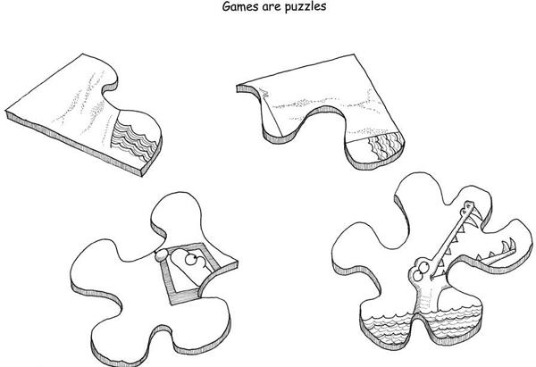
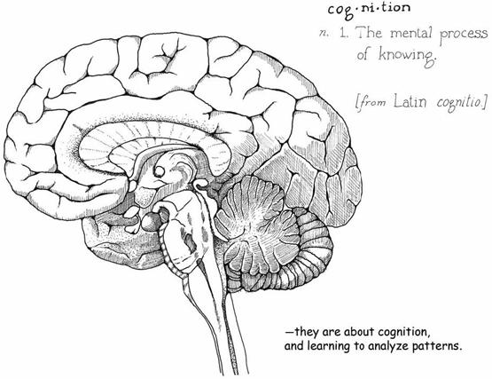
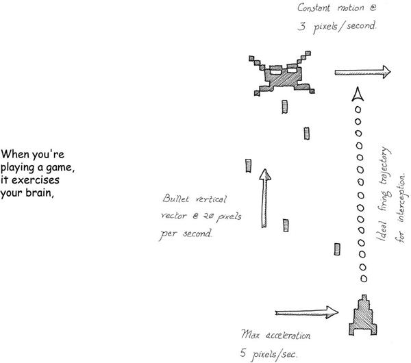
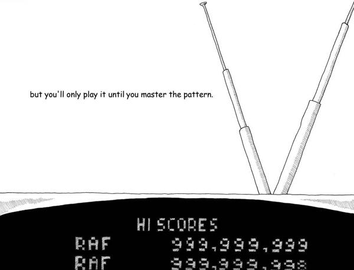
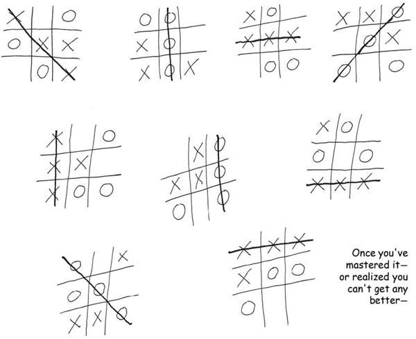
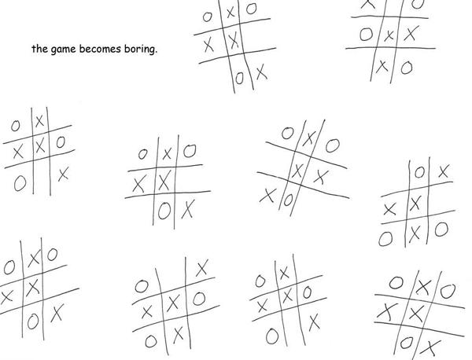
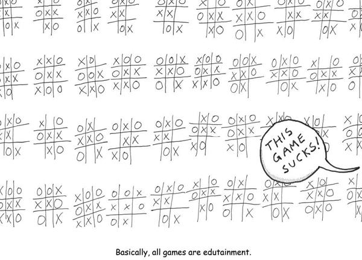

# 3. What Games Are

# Chapter 3. What Games Are

Which brings us, finally, to games.

If you review those definitions of “game” I presented earlier, you’ll see that they have some elements in common. They all present games as if they exist within a world of their own. They describe games as a simulation, a formal system, or as Huizinga put it, a “magic circle” that is disconnected from reality. They all talk about how choices or rules are important, as well as conflict. Finally, a lot of them define games as objects that aren’t real, things for pretending with.

But games are very real to me. Games might seem abstracted from reality because they are iconic depictions of patterns in the world. They have more in common with how our brain visualizes things than they do with how reality is actually formed. Since our perception of reality is basically abstractions anyway, I call it a wash.

The pattern depicted may or may not exist in reality. Nobody is claiming that tic-tac-toe is a decent mimicry of warfare, for example. But the rules we perceive—what I’ll call the pattern—get processed exactly the same way we process very real things like “fire burns” and “how cars move forward.”

Games are puzzles to solve, just like everything else we encounter in life. They are on the same order as learning to drive a car, or picking up the mandolin, or learning your multiplication tables. We learn the underlying patterns, grok them fully, and file them away so that they can be rerun as needed. The only real difference between games and reality is that the stakes are lower with games.

Games are something special and unique. They are concentrated chunks ready for our brains to chew on. Since they are abstracted and iconic, they are readily absorbed. Since they are formal systems, they exclude distracting extra details. Usually, our brains have to do hard work to turn messy reality into something as clear as a game is.

In other words, games serve as very fundamental and powerful learning tools. It’s one thing to read in a book that “the map is not the territory” and another to have your armies rolled over by your opponent in a game. When the latter happens, you’re *gonna get the point* even if the actual armies aren’t marching into your suburban home.

The distinctions between toys and games, or between play and sport, start to seem a bit picky and irrelevant when you look at them in this light. There’s been a lot of hay made over how play is non-goal-oriented and games tend to have goals; over how toys are aimed at pointless play rather than being games; about how make-believe is a form of play and not a game.

A game designer might find those distinctions useful because they provide helpful guide-posts. But all these things are the same at their most fundamental level. Perhaps this is the reason why language hasn’t done a very good job of making distinctions between “play,” “game,” and “sport.” Playing a goal-oriented game involves simply recognizing a particular sort of pattern; playing make-believe is recognizing another one. Both deservedly belong in the same category of “iconified representations of human experience that we can practice with and learn patterns from.”

Consider the key difference between something like a book and different kinds of games. A book can do the logical conscious part of the brain pretty well. And really good readers have an ability to slurp that info directly into the subconscious, intuitive mind. But what a book will never be able to do is accelerate the grokking process to the degree that games do, because you cannot practice a pattern and run permutations on it with a book.

Linguists have noticed that language obeys fairly strict mathematical rules. For example, humans cannot understand a sentence that is too deeply nested. “The bishop the fireman the mother the football player kicked the baby tossed the baby asked the mother to toss the baby called in the fire to the fire department” is a bad sentence because it violates this rule. The clauses are too deeply nested. We can puzzle it out with our slow logical conscious brain, but we work against our own natures when we do so.

Games run into similar limitations. The biggest of them is their very nature. They are exercises for our brains. Games that fail to exercise the brain become boring. This is why tic-tac-toe ends up falling down—it’s exercise, but so limited we don’t need to spend much time on it. As we learn more patterns, more novelty is needed to make a game attractive. Practicing can keep a game fresh for a while, but in many cases we’ll say, “Enh, I get it, I don’t need to practice this task,” and we’ll move on.

Almost all games fall prey to this. They are limited formal systems. If you keep playing them, you’ll eventually grok them. In that sense, games are disposable, and boredom is inevitable.

Extremely formal games are more susceptible to mathematical analysis, which is a limitation in itself. We don’t think that we can drive just because we know the rules of the road and the controls of a car, but extremely formal games (such as most board games) have fairly few variables, and so you can often extrapolate out from the known rule set. This is an important insight for game designers: *the more formally constructed your game is, the more limited it will be*. To make games more long-lasting, they need to integrate more variables (and less predictable ones) such as human psychology, physics, and so on. These are elements that arise from outside the game’s rules and from outside the “magic circle.”

(If it’s any consolation to games, that’s where game theory tends to fall down too—psych tends not to be that amenable to math.)

This finally brings us to the title of the book and the fundamental question: What is fun?

If you dig into the origins of the word, it comes either from “*fonne*,” which is “fool” in Middle English, or from “*fonn*,” which means “pleasure” in Gaelic. Either way, fun is defined as “a source of enjoyment.” This can happen via physical stimuli, aesthetic appreciation, or direct chemical manipulation.

Fun is all about our brains feeling good—the release of endorphins into our system. The various cocktails of chemicals released in different ways are basically all the same. Science has shown that the pleasurable chills that we get down the spine after exceptionally powerful music or a really great book are caused by the same sorts of chemicals we get when we have cocaine, an orgasm, or chocolate. Basically, our brains are on drugs pretty much all the time.

One of the subtlest releases of chemicals is at that moment of triumph when we learn something or master a task. This almost always causes us to break out into a smile. After all, it is important to the survival of the species that we learn—therefore our bodies reward us for it with moments of pleasure. There are many ways we find fun in games, and I will talk about the others. But this is the most important.

Fun from games arises out of mastery. It arises out of comprehension. It is the act of solving puzzles that makes games fun.

In other words, with games, learning is the drug.

Boredom is the opposite. When a game stops teaching us, we feel bored. Boredom is the brain casting about for new information. It is the feeling you get when there are no new patterns to absorb. When a book is dull and fails to lead you on to the next chapter, it is failing to exhibit a captivating pattern. When you feel a piece of music is repetitive or derivative, it grows boring because it presents no cognitive challenge.

We shouldn’t underestimate the brain’s desire to learn. If you put a person in a sensory deprivation chamber, they will get very unhappy very quickly. The brain craves stimuli. At all times, the brain is casting about trying to learn something, trying to integrate information into its worldview. It is insatiable in that way.

This *doesn’t* mean it necessarily craves new *experiences*—mostly, it just craves new *data*. New data is all it needs to flesh out a pattern. A new experience might force a whole new system on the brain, and often the brain doesn’t *like* that. It’s disruptive. The brain doesn’t like to do more work than it has to. That’s why it chunks in the first place. That’s why we have the opposite term, “sensory overload.”

Games grow boring when they fail to unfold new niceties in the puzzles they present. But they have to navigate between the Scylla and Charybdis of deprivation and overload, of excessive order and excessive chaos, of silence and noise.

This means that boredom might not wait until the end of the game. After all, brains are *really* good at pattern-matching and dismissing noise and silence.

Here are some ways in which boredom might strike, killing the pleasurable learning experience that games are supposed to provide:

* The player might grok how the game works from just the first five minutes, and then the game will be dismissed as trivial, just as an adult dismisses tic-tac-toe. “Too easy,” might be the remark the player makes.
* The player might grok that there’s a ton of depth to the possible permutations in a game but conclude that these permutations are below their level of interest—sort of like saying, “Yeah, there’s a ton of depth in baseball, but memorizing the RBI stats for the past 20 years is not all that useful to me.”
* The player might fail to see any patterns whatsoever, and nothing is more boring than noise. “This is too hard.”
* The pacing of the unveiling of variations in the pattern might be too slow, in which case the game may be dismissed as trivial too early. “This is too easy now—it’s repetitive.”
* The game might also unveil the variations too quickly, which then leads to players losing control of the pattern and giving up because it looks like noise again. “This got too hard too fast,” they’ll say.
* The player might master everything in the pattern. They have exhausted the fun, consumed it all. “I beat it.”

Any of these will result in the player stating that they are bored. In reality, some of these are boredom+frustration, and some are boredom+triumph, and so on. If your goal is to keep things fun (read as “keep the player learning”), boredom is always the signal to let you know you have failed.

The definition of a good game is therefore “one that teaches everything it has to offer before the player stops playing.”

That’s what games are, in the end. Teachers. Fun is just another word for learning.

One wonders, then, why learning is so damn boring to so many people. It’s almost certainly because the method of transmission is wrong. We praise good teachers by saying that they “make learning fun.” Games are very good teachers… of something. The question is, what do they teach?

Either way, I have an answer for my late grandfather, and it looks like what I do fits right alongside the upstanding professions of my various aunts and uncles. Fireman, carpenter, and… teacher.

