# 4. What Games Teach Us

# Chapter 4. What Games Teach Us

Formal training isn’t really required to become a game designer. Most of the game designers working professionally today are self-taught. That is changing rapidly as university programs for game designers crop up all around the country and the world.

I went to school to be a writer, mostly. I believe really passionately in the importance of writing and the incredible power of fiction. We learn through stories; we become who we are through stories.

My thinking about what fun is led me to similar conclusions about games. I can’t deny, however, that stories and games teach really different things. Games don’t usually have a moral. They don’t have a theme in the sense that a novel has a theme.

The population that uses games most effectively is the young. Certainly folks in every generation keep playing games into old age (pinochle, anyone?), but as we get older we view them more as the exception. Games are viewed as frivolity. In the Bible in 1 Corinthians, we are told, “When I was a child, I spoke like a child, I thought like a child, I reasoned like a child; when I became a man, I gave up childish ways.” But children speak honestly—sometimes too much so. Their reasoning is far from impaired—it is simply inexperienced. We assume that games are childish ways, but is that really so?

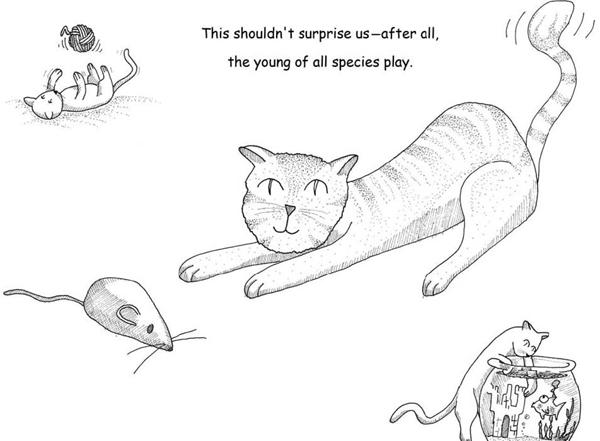

We don’t actually put away the notion of “having fun,” near as I can tell. We migrate it into other contexts. Many claim that work is fun, for example (me included). Just getting together with friends can be enough to give us the little burst of endorphins we crave.

We also don’t put aside the notion of constructing abstract models of reality in order to practice with them. We practice our speeches in front of mirrors, run fire drills, go through training programs, and role-play in therapy sessions. There are games all around us. We just don’t call them that.

As we age, we think that things are more serious and that we must leave frivolous things behind. Is that a value judgment on games or is it a value judgment on the content of a given game? Do we avoid the notion of fun because we view the content of the fire drill as being of greater import?

Most importantly—would fire drills be more effective if they were fun activities?

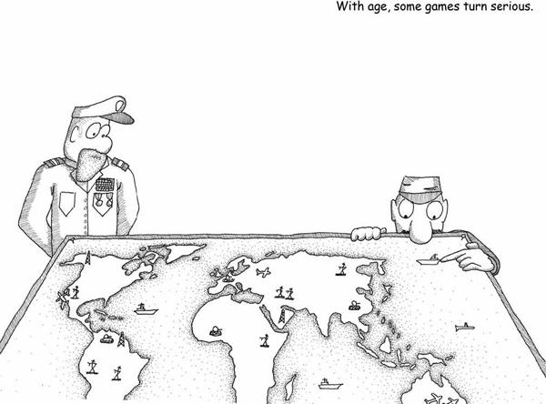

If games are essentially models of reality, then the things that games teach us must reflect on reality.

My first thought was that games are models of hypothetical realities since they often bear no resemblance to any reality I know.

As I looked deeper, though, I found that even whacked-out abstract games do reflect underlying reality. The guys who told me these games were all about vertices were correct. Since formal rule sets are basically mathematical constructs, they always end up reflecting forms of mathematical truth, at the very least. (Formal rule sets are the basis for most games, but not all—there are classes of games with informal rule sets, but you can bet that the little girls will cry “no fair” when someone violates an unstated assumption in their tea party.)

Sadly, reflecting mathematical structures is also the only thing many games do.

The real-life challenges that games prepare us for are almost exclusively ones based on the calculation of odds. They teach us how to predict events. A huge number of games simulate forms of combat. Even games ostensibly about building are usually framed competitively.

Given that we’re basically hierarchical and strongly tribal primates, it’s not surprising that most of the basic lessons we are taught by our early childhood play are about power and status. Think about how important these lessons still are within society, regardless of your particular culture. Games almost always teach us tools for being the top monkey.

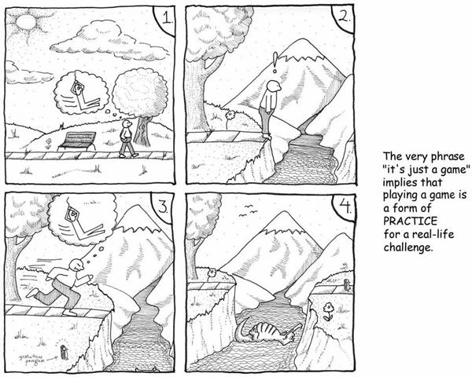

Games also teach us how to examine the environment, or space, around us. From games where we fit together odd shapes to games where we learn to see the invisible lines of power projection across a grid, much effort is spent in teaching us about territory. That is what tic-tac-toe is essentially all about.

Spatial relationships are, of course, critically important to us. Some animals might be able to navigate the world using the Earth’s magnetic field, but not us. Instead, we use maps and we use them to map all sorts of things, not just space. Learning to interpret symbols on a map, assess distance, assess risk, and remember caches must have been a critically important survival skill when we were nomadic tribesmen. But we also map things like temperature. We map social relationships (as graphs of edges and vertices, in fact). We map things over time.

Examining space also fits into our nature as toolmakers. We learn how things fit together. We often abstract this a lot—we play games where things fit together not only physically, but conceptually as well. By playing games of classification and taxonomy, we extend mental maps of relationships between objects. With these maps, we can extrapolate behaviors of these objects.

Most games incorporate some element of spatial reasoning. The space may be a Cartesian coordinate space, or it may be a directed conceptual graph, but it’s all the same thing in the end (as a mathematician will tell you). Classifying, collating, and exercising power over the contents of a space is one of the fundamental lessons of all kinds of gameplay.

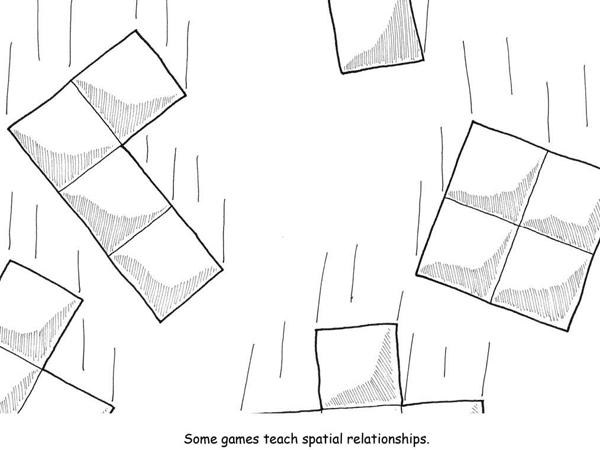

Exploring conceptual spaces is critical to our success in life. Merely understanding a space and how the rules make it work isn’t enough, though. We also need to understand how it will react to change to exercise power over it. This is why games progress over time. There are no games that take just one turn.

Let’s consider so-called “games of chance” that use a six-sided die. Here we have a possibility space—values labeled 1 through 6. If you roll dice against someone, the game you are playing might seem to end very quickly. You also might feel you don’t have much control over the outcome. You might think an activity like this shouldn’t be called a game. It certainly seems like a game you can play in one turn.

But I suggest gambling games like this are actually designed to teach us about odds. You don’t just play for one turn, and with each turn you try to learn more about how odds work. (Unfortunately, you prove you didn’t learn the lesson—especially if you are gambling for money.) We know from experiments that probability is something our brains have serious trouble grasping.

Exploring a possibility space is the only way to learn about it. Most games repeatedly throw evolving spaces at you so that you can explore the recurrence of symbols within them. A modern video game will give you tools to navigate a complicated space, and when you finish, the game will give you another space, and another, and another.

Some of the really important parts of exploration involve memory. A huge number of games involve recalling and managing very long and complex chains of information. (Think about counting cards in blackjack or playing competitive dominoes.) Many games involve thoroughly exploring the possibility space as part of their victory condition.

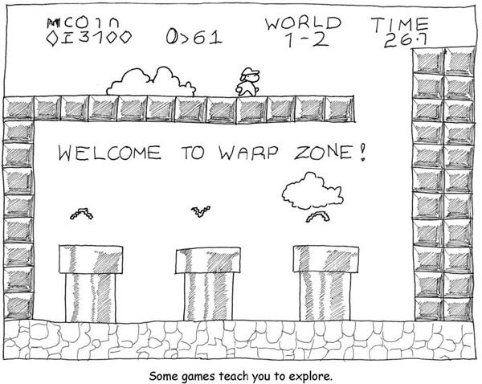

In the end, most games have something to do with power. Even the innocuous games of childhood tend to have violence lurking in their heart of hearts. Playing “house” is about jockeying for social status. It is richly multileveled, as kids position themselves in authority or not over other kids. They play-act at using the authority that their parents exercise over them. (There’s this idealized picture of girls as being all sweetness and light, but there are few more viciously status-driven groups on earth.)

Consider the games that get all the attention lately: shooters, fighting games, and war games. They are not subtle about their love of power. The gap between playing these games and cops and robbers is small as far as the players are concerned. They are all about reaction times, tactical awareness, assessing the weaknesses of an opponent, and judging when to strike. Just as my playing guitar was in fact preparing me for playing mandolin by teaching me skills beyond basic guitar fretting, these games teach many skills that are relevant in a corporate setting. We pay attention to the obvious nature of a particular game and we miss the subtler point; be it cops and robbers or *CounterStrike*, the real lessons are about team-work and not about aiming.

Think about it; teamwork is a far deadlier tool than sharpshooting.

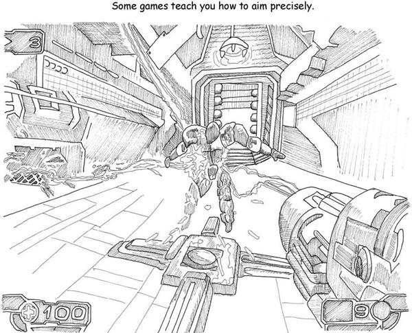

Many games, particularly those that have evolved into the classic Olympian sports, can be directly traced back to the needs of primitive humans to survive under very difficult conditions. Many things we have fun at doing are in fact training us to be better cavemen. We learn skills that are antiquated. Most folks never need to shoot something with an arrow to eat, and we run marathons or other long races mostly to raise funds for charities.

Nonetheless, we have fun mostly to improve our life skills. And while there may be something deep in our reptile brains that wants us to continue practicing aiming or sentry-posting, we do in fact evolve games that are more suited to our modern lives.

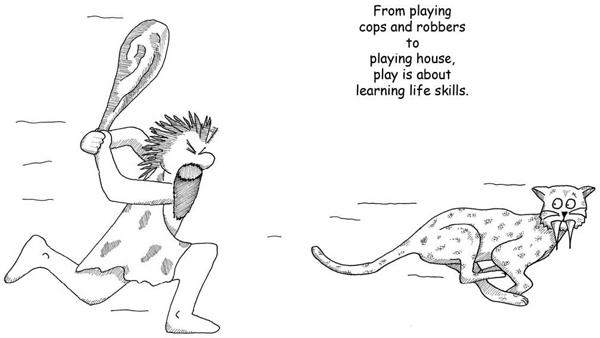

For example, there are many games in my collection that relate to network building. Building railway lines or aqueducts wasn’t exactly a caveman activity. As humans have evolved, we’ve changed around our games. In early versions of chess, queens weren’t nearly as powerful a piece as they are today.

Many games have become obsolete and are no longer played. Grain harvesting used to be a really big deal, but it isn’t now. You can’t find many games about farming on the market as a result. In general, the level of mathematical sophistication required by games has risen dramatically over the course of human history as common people learned how to do sums. Word games were once restricted to the elite, but today they are enjoyed by the masses.

Games do adapt, but perhaps not as fast as we might wish, since almost all of these games are still, at their core, about the same activities even though they may involve different skill sets.

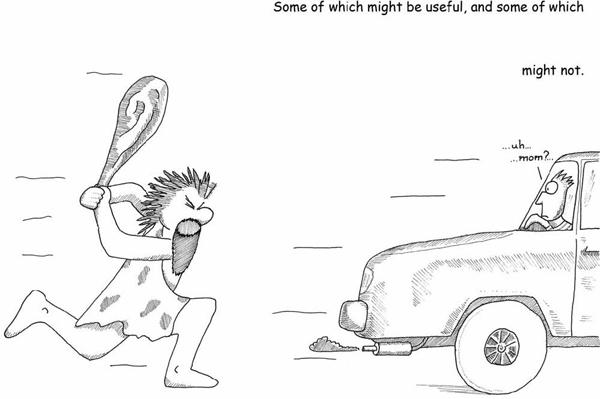

In some ways games can be compared to music (which is even more mathematically driven). Music excels at conveying only a few things—emotion being paramount among them. Games do very well at active verbs: controlling, projecting, surrounding, matching, remembering, counting, and so on. Games are also very good at quantification.

By contrast, literature can tackle all of the above and more. Over time, language-based media have tackled increasingly broader subjects.

Games are also capable of modeling situations of greater richness and complexity. Games like *Diplomacy* are evidence that remarkably subtle interactions can be modeled within the confines of a rule set, and traditional role-playing can reach the same heights as literature in the right hands. But it is an uphill battle nonetheless, simply because games are at their core about teaching us survival skills. As we all know, when you’re worried about subsistence and survival, more refined things tend to fall by the wayside.

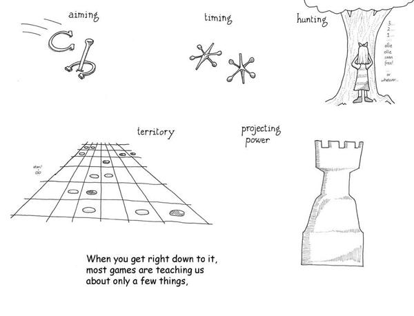

It’s worth asking ourselves what skills are more commonly needed today. Games should be evolving toward teaching us those skills.

The entire spread of games for children is fairly limited and hasn’t changed much. The basic skills needed by children are the same. Perhaps we need a few more games about changing TV channels, but that’s about it. Adults, on the other hand, could use new games that teach more relevant skills. Most of us no longer hunt our own food and we no longer live in danger every moment of our lives. It’s still valuable to train ourselves in some of the caveman traits, but we need to adapt.

Some traits are relevant but need to change because conditions have changed. Interesting research has been done into what people find disgusting, for example. Disgust is a survival trait that points us away from grayish-green, mucousy, slimy things. It does so because that was the most likely vector for illness.

Today it might be the electric blue fluid that is the real risk—don’t drink any drain cleaner—and we have no inborn revulsion toward it. In fact, it’s made electric blue to make it seem aseptic and clean. That’s a case where we should supplement our instincts with training, since I doubt there’s anything I can drink under my kitchen sink.

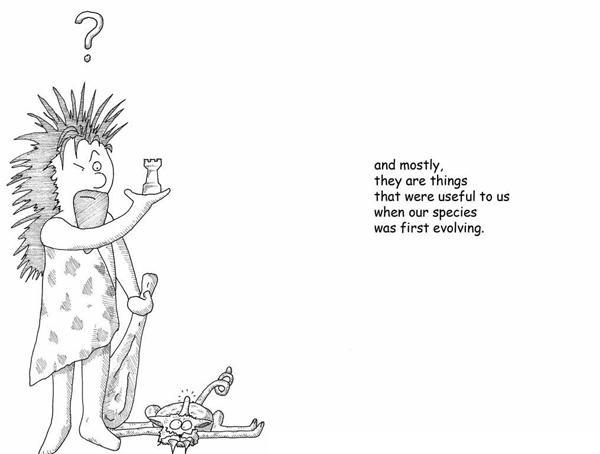

Some of the new patterns we need to learn in our brave new world run contrary to our instinctive behaviors. For example, humans are tribal creatures. We not only fall readily into groups run by outsize personalities, but we’ll often subsume our better judgment in doing so. We also seem to have an inbred dislike of groups not our own. It is very easy to get humans to regard a different tribe as less than human, particularly if they look or act differently in some way.

Maybe this was a survival trait at one time, but it’s not now. Our world grows ever more interdependent; if a currency collapse occurs on the other side of the world, the price of milk at our local grocery could be affected. A lack of empathy and understanding of different tribes and xenophobic hatred can really work against us.

Most games encourage demonizing the opponent, teaching a sort of ruthlessness that is a proven survival trait. But these days, we’re less likely to need or want the scorched-earth victory. Can we create games that instead offer us greater insight into how the modern world works?

If I were to identify other basic human traits that games currently tend to reinforce and that may be obsolete legacies of our heritage, I might call out traits like

* Blind obedience to leaders and cultism
* Rigid hierarchies
* Binary thinking
* The use of force to resolve problems
* Like seeking like, and its converse, xenophobia

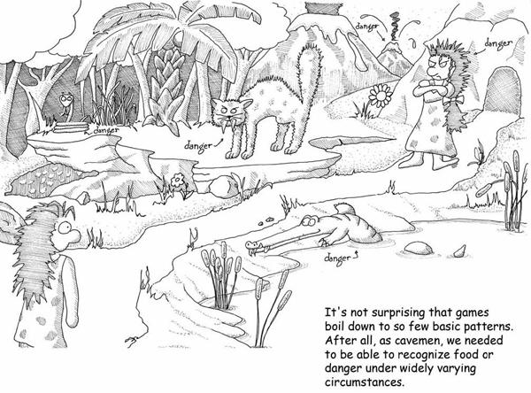

For better or worse, games have been ringing changes on the same few subjects. There’s probably something deep in the reptile brain that is deeply satisfied by jumping puzzles, but you’d think that by now we would have jumped over everything in every possible way.

When I first started playing games, everything was tile based, meaning that you moved in discrete squares, as if you were popping from tile to tile on a tiled floor. Nowadays you move in a much freer way, but what has changed is the fidelity of the simulation, not what we’re simulating. The skills required are perhaps closer to being what they are in reality, and yet an improvement in the simulation of crossing a pond full of alligators is not necessarily something relevant.

The mathematical field of studying shape and the way in which apparent shapes can change but remain the same is called *topology*. It can be helpful to think of games in terms of their topology.

Early platform games followed a few basic gameplay paradigms.

* **“Get to the other side” games**. *Frogger, Donkey Kong, Kangaroo*. These are not really very dissimilar. Some of these featured a time limit, some didn’t.
* **“Visit every location” games**. Probably the best known early platformer like this was *Miner 2049er, Pac-Man* and *Q\*Bert* also made use of this mechanic. The most cerebral of these were probably *Lode Runner* and *Apple Panic*, where the map traversal could get very complex given the fact that you could modify the map to a degree.

Games started to meld these two styles, then they added scrolling environments. Eventually designers added playing in 3-D on rails and finally made the leap to true 3-D with *Mario 64*.

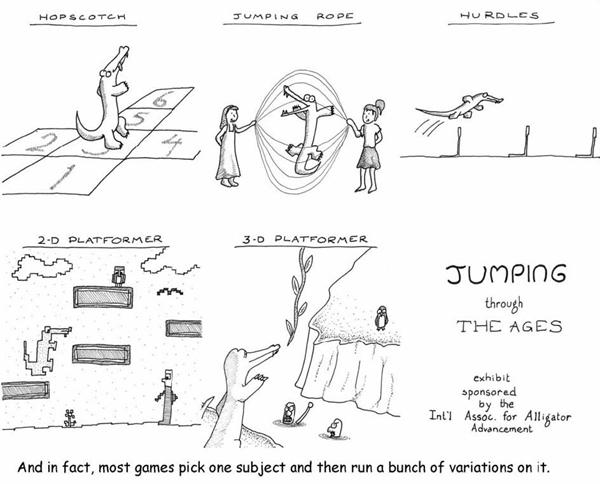

A modern platformer makes use of all of these dimensions:

* “Get to the other side” is still the basic paradigm.
* “Visit all the map” is handled by a “secrets” system.
* Time limits add another dimension of challenge.

Since the original *Donkey Kong*, players have been able to pick up a hammer to use as a weapon. One of the commonest signs of incremental innovation in game design is designers simply adding more of a given element rather than adding a new element. Hence, today we have a bewildering array of weapons.

Platformers have now covered all the dimensions. They have started pulling in elements of racing and flying games and fighters and shooters. They have built in secret discovery and time limits and power-ups. Recent games have included more robust stories and even elements from role-playing games. Are there more dimensions on which to expand?

Going from *Pong* to a modern tennis game is not so large a leap. How odd that we’ve ended up in the recursive pattern of making games that model other games—it suggests that there’s something that the real-life sport of tennis can teach that doesn’t require running around on a court in a white outfit now. Nonetheless, rather than teaching the skill of hurling rocks and judging trajectories, it would be nice if games instead taught things like whether or not the price of oil is going to rise in response to signing or not signing a global warming treaty.

This may sound bleak, but in fact, it’s not. The skills needed around a meeting room table and the skills needed at the tribal council are not so different, after all. There are whole genres of game that are about husbandry, resource management, logistics, and negotiation. If anything, the question to ask might be why the most popular games are the ones that teach obsolete skills while the more sophisticated ones that teach subtler skills tend to reach smaller markets.

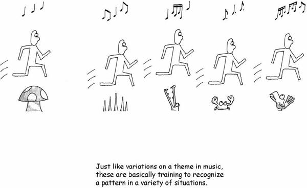

A lot of it can probably be traced to visceral appeal. Remember, we live most of our lives in the unconscious. Action games let us stay there, whereas games that demand careful consideration of logistics might require logical, conscious thought. So we ring changes on old, often irrelevant challenges because, frankly, it’s easier.

We’ve evolved exquisite sensitivity to visceral challenges. A survey of games featuring jumping found that the games with the “best controls” all shared an important characteristic: when you hit the jump button, the character on screen spent almost exactly the same amount of time in the air. Games with “bad controls” violated this unspoken assumption. I’m pretty sure that if we went looking, we’d find that good jumping games have been unscientifically adhering to this unspoken rule for a couple of decades, without ever noticing its existence.

That’s hardly the only case of our adjusting our work to better target the unconscious mind. A very common feature of action games, for example, is to push you through a task faster and faster. This is purely intended to address the visceral reaction and the autonomic nervous system. When you learn any physical skill, you are told to do it slowly at first and slowly increase the speed as you master the task. The reason is that developing speed without precision is not all that useful. Going slow lets you practice the precision first, make it unconscious, and then work on the speed.

You don’t tend to see “time attack” modes in strategy games, for this same reason. The tasks in the strategic games are not about automatic responses, and therefore the training to execute at reflex levels of speed would be misguided. (If anything, a good strategy game will teach you not to get too familiar with the situation and will keep you on your toes.)

This whole approach is intended for learning by rote. When I was a kid, I had a game for the Atari 2600 console called *Laser Blast*. I got to the point where I could get a million points at the maximum difficulty setting without ever dying. With my eyes closed. This is the same sort of training that we put our militaries through—the training of rote and reflex. It’s not a very *adaptable* mode of training, but it is desirable in many cases.

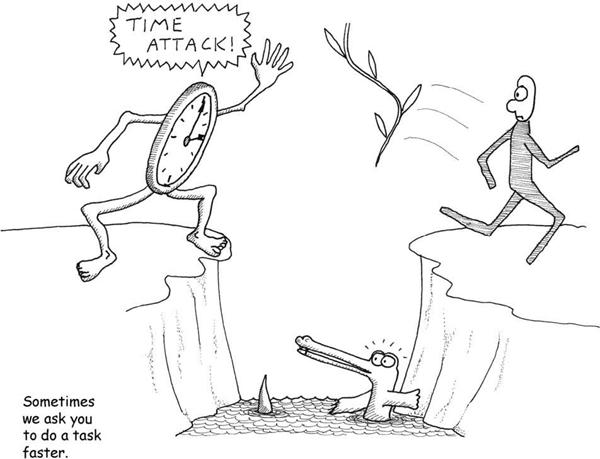

A more interesting tactic that applies to a wider range of games is asking the player to be thorough. This is a broader survival skill. It requires patience, and a certain enjoyment of discovery. It also works against our inclination to work directly on the final goal.

In many games, you are asked to find “secrets” or to explore an area completely. This teaches many interesting things, such as considering a problem from all angles, making sure that you should make sure you have all the information before you make a decision, and thoroughness is often better than speed. Not to denigrate training by rote and reflex, but this is a much subtler and interesting set of skills to teach, and one that is more widely applicable to the modern world.

Games have these characteristics:

* They present us with models of real things—often highly abstracted.
* They are generally quantified or even *quantized* models.
* They primarily teach us things that we can absorb into the unconscious as opposed to things designed to be tackled by the conscious, logical mind.
* They mostly teach us things that are fairly primitive behaviors, but they don’t *have* to.

Seen in this light, it’s not surprising that the evolution of the modern video game can largely be explained in terms of topology. Each generation of game can be described by a relatively minute alteration in the shape of the play space. For example, there have only really been around five fighting games in all of videogaming history. Significant advances have been limited to a few features like movement on a plane, movement in 3-D, and the addition of “combos” or sequences of moves.

This is not to say that many of the classic fighting games didn’t bring significant incremental advances. Of course they did. But did they effectively “add another hole to the donut”?

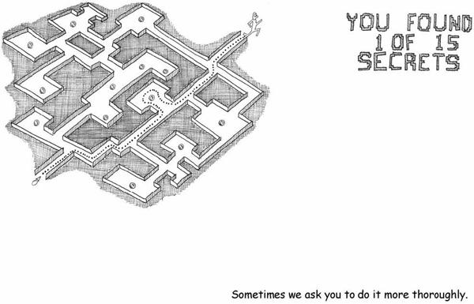

Consider the evolution of the 2-D shooter or “shmup.” *Space Invaders* offered a single screen with enemies that marched predictably. After that came *Galaxian*, which had no defenses and enemies that attacked a bit more aggressively.

Simple topological variants then ensued: *Gyruss* and *Tempest* are just *Galaxian* in a circle. *Gorf* and others added scrolling and also had an end boss and stages that changed in nature as you progressed. *Zaxxon* added verticality, which was then quickly thrown away in the development of the genre. *Centipede* gave you some room to maneuver at the bottom, and a charming setting, but isn’t really that different from *Galaxian. Asteroids* is an inverted circle: you’re in the middle, and the enemies come from outside.

*Galaga* was probably the most influential of all of these because it added bonus levels and the power-up, a concept that has become standard in every shmup since. *Xevious* and *Vanguard* added alternate modes of fire (bombs and firing in other directions). *Robotron* and *Defender* are special cases. Both have the element of rescuing. This has been pretty much abandoned today (sadly—though *Choplifter* was a wonderful sidetrack there).

Now, I don’t know what the first 2-D shooter to have power-ups and scrolling and bosses at the end of stages was, but a case can be made that there hasn’t been a topologically different 2-D shooter since. Unsurprisingly, the shooter genre has stagnated and lost market share. After all, we learned that mechanic a long time ago, and everything since has been learning patterns that we *know* to be artificial and unlikely to be repeated anywhere.

This offers a possible algorithm for innovation: *find a new dimension to add to the gameplay*. We saw this in the way that puzzle games evolved after *Tetris*: people started trying to do it with hexagons, with three dimensions, and eventually, pattern matching of colors became the thing that replaced spatial analysis. If we really wanted to innovate on puzzle games, how about exploring puzzle games based on time rather than space, for example?

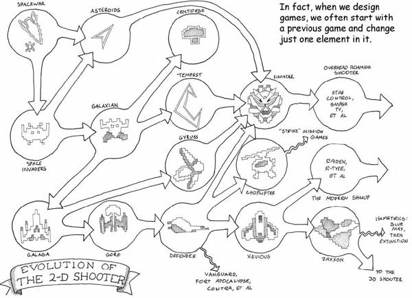

[*OceanofPDF.com*](https://oceanofpdf.com)
