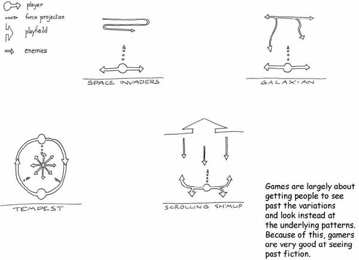
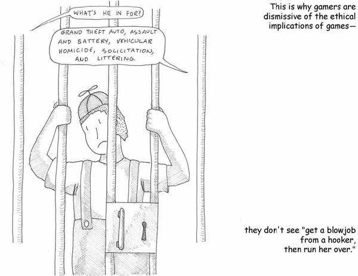
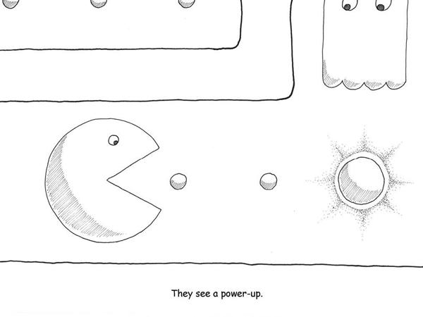
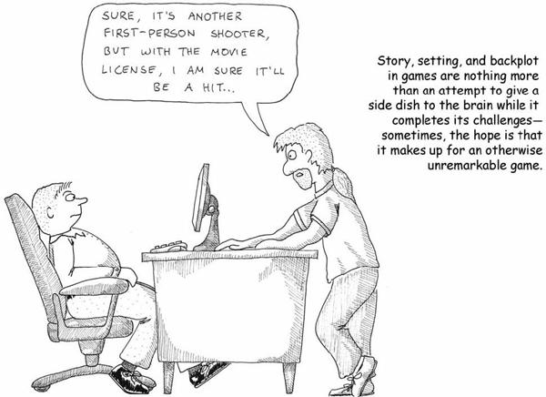
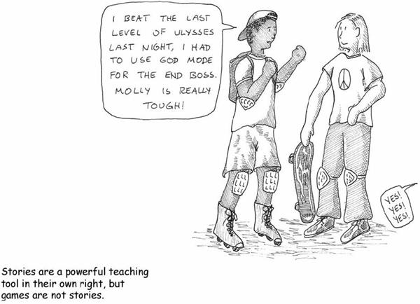
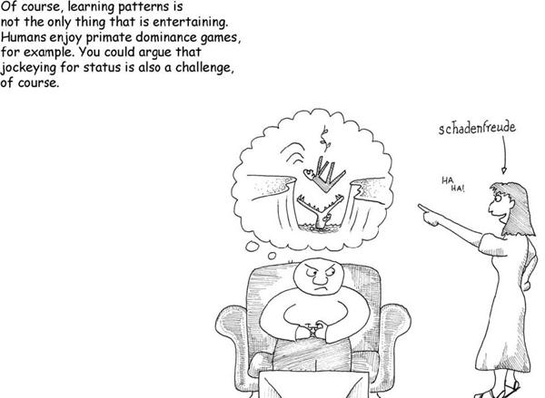
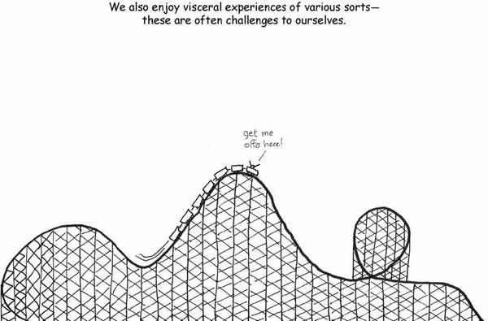
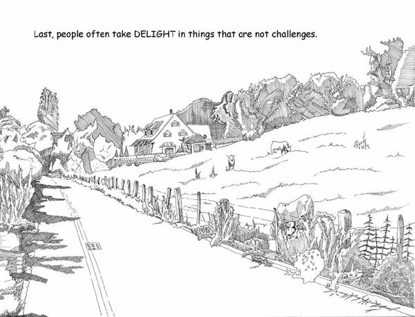
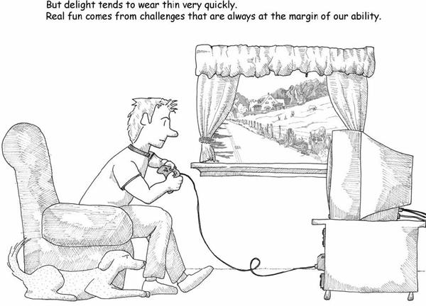
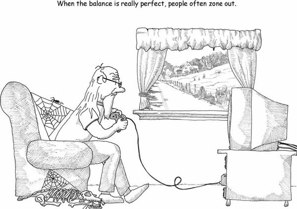

# 5. What Games Aren’t

# Chapter 5. What Games Aren’t

Until now, I’ve been discussing formal game design—abstract simulations. But we rarely see truly abstract simulations in games. People tend to dress up game systems with some fiction. Designers put artwork on them that is suggestive of some real-world context. Take checkers for example—abstractly, it’s a board game about entrapment and forced action, played on a diamond-shaped grid. When we say “king me” in checkers, we’re adding a subtle bit of fiction to the game; suddenly it has acquired feudal overtones and a medieval context. Usually, the pieces have a crown embossed on them.

This is similar to word problems in math class. The fiction serves two purposes: it trains you to see past it to the underlying math problem, and it also trains you to recognize real-world situations where that math problem might be lurking.

Games in general tend to be like word problems. You won’t find many games that are pure unclothed abstractions. Most games have more in common with chess or checkers—they provide some level of misdirection. Usually there are metaphors for what is going on in the game.

While metaphors are fun to play with, players can basically ignore them. The name of the unique checker piece that has made it to the other side is basically irrelevant, mathematically speaking. We could call the regular pieces chickens and the crowned ones wolves and the game would not change one whit.

Games, by the very nature of what they teach, push toward this sort of understanding. Since they are about teaching underlying patterns, they train their players to ignore the fiction that wraps the patterns.

Back in 1976, a company called Exidy scored a first in video game history: its game *Deathrace* was taken off the market because of public concerns about the game’s violent nature. *Deathrace* was loosely based on a movie called *Deathrace 2000*. The premise involved driving a car to run over pedestrians for points.

Mechanically, *Deathrace* was the same as any other game that involved catching objects moving around the screen. If you looked at this game today, however, with its crude pixilated graphics and its tiny iconic people, you wouldn’t be particularly shocked. After all, countless other gore-fests have come along that make the game look quaint.

I don’t think debates about the suitability of violence in the media will disappear. Much evidence shows that media have some effect on how we act. If media didn’t have an effect, we wouldn’t spend so much effort on using it as teaching tools. But evidence also shows that media aren’t mind-control devices (of course they aren’t, or else we’d all behave like the people we read about in the children’s stories we read in elementary school).

Gamers, however, have always viewed this issue with some perplexity. When they defend their beloved games, they use one of the most self-defeating rallying cries in history: “It’s only a game!”

In the wake of school shootings and ex-military people decrying first-person shooters as “murder simulators,” this argument doesn’t carry a lot of weight. Academics who disagree with the portrayal of games as damaging to children tend to muster learned arguments about privileged spaces and magic circles. Much of the public dismisses these arguments as coming from an ivory tower.

But there’s a very good reason why the gamers are incredulous.

Remember, games train us to see underlying mathematical patterns. The fact that I can describe *Deathrace* as being a game about picking up objects on a two-dimensional playing field is evidence that its “dressing” is largely irrelevant to what the game is about at its core. As you get more into a game, you’ll most likely cut to the chase and examine the true underpinnings of the game, just as a music aficionado can cut past the lyrical content of different types of Latin music and determine whether a given song is a *cumbia* or a *marinera* or a *salsa*.

Running over pedestrians, killing people, fighting terrorists, and eating dots while running from ghosts are all just stage settings, convenient metaphors for what a game is actually teaching. *Deathrace* does not teach you to run over pedestrians any more than *Pac-Man* teaches you to eat dots and be scared of ghosts.

None of this is to minimize the fact that *Deathrace does* involve running over pedestrians and squishing them into little tombstone icons. That’s there, for sure, and it’s kind of reprehensible. It’s not a great setting or staging for the game, but it’s also not what the game is really about.

Learning to see that division is important to our understanding of games, and I’ll touch on it at greater length later. For now, suffice it to say that the part of games that is *least* understood is the formal abstract system portion of it, the mathematical part of it, the chunky part of it. Attacks on other aspects of games are likely to miss the key point—at their core games need to develop this formal aspect of themselves in order to improve.

Alas, that isn’t what we tend to focus on.

The commonest route these days for developing games involves grafting a story onto them. But most video game developers take a (usually mediocre) story and put little game obstacles all through it. It’s as if we are requiring the player to solve a crossword puzzle in order to turn the page to get more of the novel.

By and large, people don’t play games because of the stories. The stories that wrap the games are usually side dishes for the brain. For one thing, it’s damn rare to see a game story written by an actual writer. As a result, they are usually around the high-school level of literary sophistication at best.

For another, since the games are generally about power, control, and those other primitive things, the stories tend to be so as well. This means they tend to be power fantasies. That’s generally considered to be a pretty juvenile sort of story.

The stories in most video games serve the same purpose as calling the über-checker a “king.” It adds interesting shading to the game but the game at its core is unchanged.

Remember—my background is as a writer, so this actually pisses me off. Story deserves better treatment than that.

Games are not stories. It is interesting to make the comparison, though:

* Games tend to be experiential teaching. Stories teach vicariously.
* Games are good at objectification. Stories are good at empathy.
* Games tend to quantize, reduce, and classify. Stories tend to blur, deepen, and make subtle distinctions.
* Games are external—they are about people’s actions. Stories (good ones, anyway) are internal—they are about people’s emotions and thoughts.

In both cases, when they are good, you can come back to them repeatedly and keep learning something new. But we never speak of fully mastering a good story.

I don’t think anyone would quarrel with the notion that stories are one of our chief teaching tools. They might quarrel with the notion that play is the other and that mere lecturing runs a distant third. I also don’t think that many would quarrel with the notion that stories have achieved far greater artistic heights than games have, despite the fact that play probably *predates* story (after all, even animals play, whereas stories require some form of language).

Are stories superior? We often speak of wanting to make a game that makes players cry. The classic example is the text adventure game *Planetfall*, where Floyd the robot sacrifices himself for you. But it happens outside of player control, so it isn’t a challenge to overcome. It’s grafted on, not part of the game. What does it say about games that the peak emotional moment usually cited actually involves *cheating*?

Games do better at emotions that relate to mastery. Stories can get these too, however. Getting emotional effects out of games may be the wrong approach—perhaps a better question is whether stories can be fun in the way games can.

When we speak of enjoyment, we actually mean a constellation of different feelings. Having a nice dinner out can be fun. Riding a roller coaster can be fun. Trying on new clothes can be fun. Winning at table tennis can be fun. Watching your hated high school rival trip and fall in a puddle of mud can be fun. Lumping all of these under “fun” is a rather horribly vague use of the term.

Different people have classified this differently. Game designer Marc LeBlanc has defined eight types of fun: sense-pleasure, make-believe, drama, obstacle, social framework, discovery, self-discovery and expression, and surrender. Paul Ekman, a researcher on emotions and facial expressions, has identified literally dozens of different emotions—it’s interesting to see how many of them only exist in one language but not in others. Nicole Lazzaro did some studies watching people play games, and she arrived at four clusters of emotion represented by the facial expressions of the players: hard fun, easy fun, altered states, and the people factor.

My personal breakdown would look a lot like Lazzaro’s:

* **Fun** is the act of mastering a problem mentally.
* **Aesthetic appreciation** isn’t always fun, but it’s certainly enjoyable.
* **Visceral reactions** are generally physical in nature and relate to physical mastery of a problem.
* **Social status maneuvers** of various sorts are intrinsic to our self-image and our standing in a community.

All of these things make us feel good when we’re successful at them, but lumping them all together as “fun” just renders the word meaningless. So throughout this book, when I have referred to “fun,” I’ve meant only the first one: mentally mastering problems. Often, the problems mastered are aesthetic, physical, or social, so fun can appear in any of those settings. That’s because all of these are feedback mechanisms the brain gives us for successfully exercising survival tactics.

Physical challenges alone aren’t fun. The feeling of triumph when you break a personal record is. Endurance running can be immensely satisfying but you have not solved a puzzle. It is not the same high as when you win a well-fought game of soccer thanks to your teamwork.

Similarly, autonomic responses aren’t fun in and of themselves. You have them developed already, so the brain only rewards you for doing them in the context of a mental challenge. You don’t get a high from just typing, you get it from typing while pondering what to say, or from typing during a typing game.

Social interactions of all sorts are often enjoyable as well. The constant maneuvering for social status that all humans engage in is a cognitive exercise and therefore essentially a game. There is a constellation of positive emotions surrounding interpersonal interactions. Almost all of them are signals of either pushing someone else down, or pushing yourself up, on the social ladder. Some of the most notable include:

* **Schadenfreude**, the gloating feeling you get when a rival fails at something. This is, in essence, a put down.
* **Fiero**, the expression of triumph when you have achieved a significant task (pumping your fist, for example). This is a signal to others that you are valuable.
* **Naches**, the feeling you get when someone you mentor succeeds. This is a clear feedback mechanism for tribal continuance.
* **Kvell**, the emotion you feel when bragging about someone you mentor. This is also a signal that you are valuable.
* **Grooming behaviors**, a signal of intimacy often representing relative social status.
* **Feeding other people**, which is a very important social signal in human societies.

A lot of these feel good, but they aren’t necessarily “fun.”

Aesthetic appreciation is the most interesting form of enjoyment. Science fiction writers call it “sensawunda.” It’s awe, it’s mystery, it’s harmony. I call it delight. Aesthetic appreciation, like fun, is about patterns. The difference is that aesthetics is about *recognizing* patterns, not learning new ones.

Delight strikes when we recognize patterns but are surprised by them. It’s the moment at the end of *Planet of the Apes* when we see the Statue of Liberty. It’s the thrill at the end of the mystery novel when everything falls into place. It’s looking at the Mona Lisa and seeing that smile hovering at the edge of known expressions and matching it to our hypothesis of what she’s thinking. It’s seeing a beautiful landscape and thinking all is right in the world.

Why does a beautiful landscape make us feel that way? Because it meets our expectations, and *exceeds* them. We find things beautiful when they are very close to our idealized image of what they should be but with an additional surprising wrinkle. A perfectly closed off plot, with just a couple of loose threads. A picture of a farmhouse, but the paint is peeling. Music that comes back to the tonic note and then drops a whole step further to end on an unresolved minor seventh. It sends us chasing off after new patterns.

Beauty is found in the tension between our expectation and the reality. It is *only* found in settings of extreme order. Nature is full of extremely ordered things. The flowerbed bursting its boundaries is expressing the order of growth, the order of how living things stretch beyond their boundaries, even as it is in tension with the order of the well-manicured walkway.

Delight, unfortunately, doesn’t last. It’s like the smile from a beautiful stranger in a stair-well—it’s fleeting. It cannot be otherwise—recognition is not an extended process.

You can regain delight by staying away from the object that caused it previously, then returning. You’ll get that recognition again. But it’s not quite what I would call fun. It’s something else—our brains rewarding us for having learned well. It is the epilogue to the story. The story itself is the fun of learning.

Fun, as I define it, is the feedback the brain gives us when we are absorbing patterns for learning purposes. Consider the basketball team that says, “We went out there to have fun tonight,” versus the one that says, “We went out there to win.” The latter team is approaching the game as no longer being practice. Fun is primarily about practicing and learning, not about exercising mastery. Exercising mastery will give us some other feeling, because we are doing it *for a reason*, such as status enhancement or survival.

The lesson here is that *fun is contextual*. The reasons why we are engaging in an activity matter a lot. School is not usually all that fun because we take it seriously—it’s not practice, it’s for real, and your grades and social standing and clothing determine whether you are in the in-crowd or whether you sit at the table close to the cafeteria kitchen.

It’s very telling that when we lose a competition, we often say, “Well, I was just doing it for fun.” The implication is that we are shrugging off the implicit loss of social status inherent in a loss. Since it was merely a form of practice, perhaps we didn’t put forth our best effort.

We get positive feedback for climbing the social ladder. We’re just tribal monkeys throwing feces at each other in order to own the top of the tree. But notice some of the subtleties there: climbing it while helping others (naches and kvell). Climbing it while pushing the boundaries of our knowledge (fun). Climbing it while strengthening our social networks, building communities and families that work together to improve everyone’s lot (grooming, pairing, and feeding others).

As monkeys go, that’s pretty darn good. In the general run of animals, it’s amazing. It’s a lot better than being a shark that only gets feedback for eating.

I think there’s a good case to be made that having fun is a key evolutionary advantage right next to opposable thumbs in terms of importance. Without that little chemical twist in our brains that makes us enjoy learning new things, we might be more like the sharks and ants of the world.

So how does it feel? Well, the moment a lot of players like to cite is “being in the zone.” If you get academic about it, you might reference Csikszentmihalyi’s concept of “flow.” This is the state you enter when you are experiencing absolute concentration on a task. When you’re in absolute control, the challenges that come at you are met precisely by your skills. Lazzaro called this “hard fun,” and it’s the state from which you are most likely to emerge feeling either frustration or triumph.

Flow doesn’t happen very often, but when it does it feels pretty darn wonderful. The problem is that precisely matching challenges to capability is incredibly hard. For one thing, the brain is churning away and might make a cognitive leap at any moment, rendering the rest of the challenge trivial. For another, whatever is presenting the challenges doesn’t necessarily have any sense of the level of understanding possessed by the player.

As we succeed in mastering patterns thrown at us, the brain gives us little jolts of pleasure. But if the flow of new patterns slows, then we won’t get the jolts and we’ll start to feel boredom. If the flow of new patterns increases beyond our ability to resolve them, we won’t get the jolts either because we’re not making progress.

When there’s flow, players usually say afterward, “That was a *lot* of fun.” When there isn’t flow, they might say “that was fun” somewhat less emphatically. The absence of flow doesn’t preclude fun—it just means that instead of a steady drip-drip-drip of endorphins, you’re getting occasional bits. And in fact, there can be flow that isn’t fun—meditation induces similar brain waves, for example.

So fun isn’t flow. You can find flow in countless activities, but they aren’t all fun. Most of the cases where we typically cite flow relate to exercising mastery, not learning.

To recap the preceding pages: Games aren’t stories. Games aren’t about beauty or delight. Games aren’t about jockeying for social status. They stand, in their own right, as something incredibly valuable. Fun is about learning in a context where there is no pressure, and that is why games matter.

