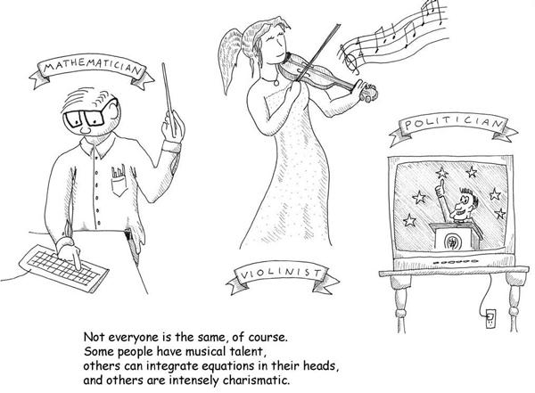
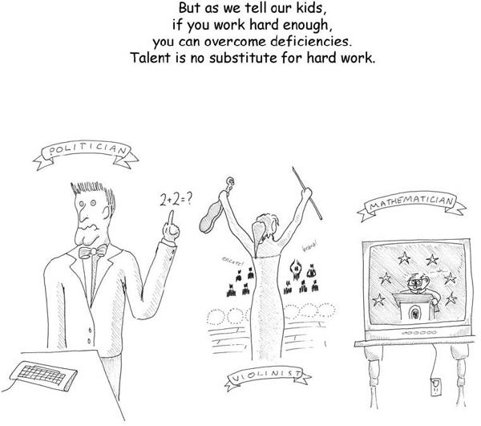
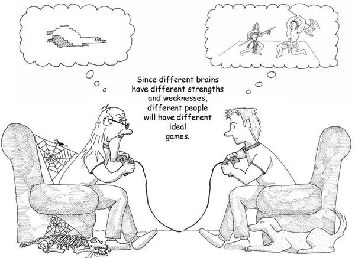
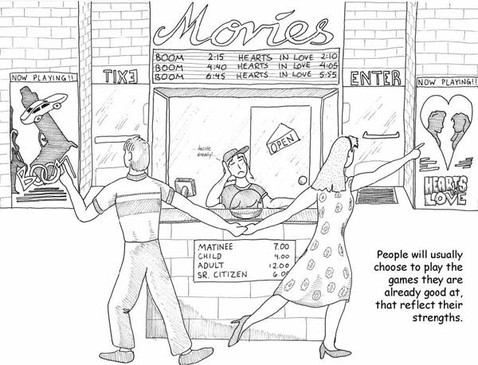
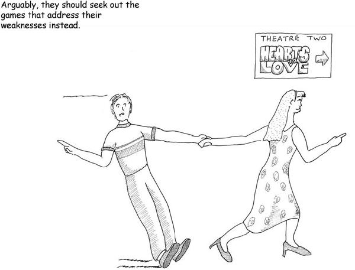

# 6. Different Fun for Different Folks

# Chapter 6. Different Fun for Different Folks

We all know that people learn at different rates and in different ways. Research has shown that people’s learning patterns are with them at birth. Some people visualize things when they think of them; others are more verbal. Some people employ logic readily; others rely on leaps of intuition. We’re all familiar with the bell curve distribution of IQ—and we’re also familiar with the fact that IQ tests do not measure all forms of intelligence. Howard Gardner said there were in fact seven forms:

1. Linguistic
2. Logical-mathematical
3. Bodily-kinesthetic
4. Spatial
5. Musical
6. Interpersonal
7. Intrapersonal (internally directed, self-motivated)

There aren’t really standardized tests for these other types of intelligences. Certainly, the list suggests right off the bat that these different people will be interested in different sorts of games because of their natural talents. Keep in mind that people are not likely to tackle patterns and puzzles that appear as noise to them; they’ll likely select problems that they think they have a chance at solving. Hence the folks with bodily-kinesthetic intelligence will gravitate toward sports, whereas the linguistic folks may end up with crossword puzzles or *Scrabble*.

In recent years, much study has been centered on gender differences. It has finally become acceptable to discuss this topic without accusations of sexism. It’s important to realize that in all cases, we’re speaking in generalities, of averages. On average, females tend to have greater trouble with certain types of spatial perception—for example, visualizing the cross section of an arbitrary shape that has been rotated to a different facing. Conversely, males tend to have greater trouble with language skills—doctors have long known that it takes longer for boys to become verbally proficient.

It speaks well of the power of video games that they can actually change this. After all, the equation is both nature *and* nurture. Research has shown that if women who have trouble with spatial rotation tests are given a video game that encourages them to practice rotating objects and matching particular configurations in 3-D, not only will they master the spatial perception necessary, but the results will be *permanent*.

One researcher in the U.K., Simon Baron-Cohen, has concluded that there are “systematizing brains” and “empathizing brains.” He identifies extreme systematizing brains as being autistic and ones just slightly less so as being those diagnosed as having Asperger’s syndrome. The distribution curve of systematizing brains versus empathizing brains, according to Baron-Cohen, is apparently influenced by gender. Men are more likely to have systematizing brains, and women more likely to have empathizing brains.

According to Baron-Cohen’s theory, there are people who have high abilities in both systematizing and empathizing. One would surmise that these people tend to go into the arts, which are heavily systematic and also require a high degree of empathy. Baron-Cohen postulates that having high abilities in both is a contraindicated survival trait since it means that they are almost certainly not as good at either as the “specialists.” This may explain all those consumptive poets dying in garrets.

Another way to look at this is not in terms of intelligence but in terms of learning styles. Here again, gender shows itself. Men not only navigate space differently, but they tend to learn by trying, whereas women prefer to learn through modeling another’s behavior.

The classic ways of looking at learning styles and personalities are the Keirsey Temperament Sorter and the Myers-Briggs personality type. These are the ones with the four letter codes like INTP, ENFJ, and so on. Of course, there’s also astrology, enneagrams, and lots of others. We can debate the validity of the various methods, but it does seem clear that they sort people into categories based on *something* and that there are different sorts of people in the world.

It’s clear that players tend to prefer certain types of games in ways that seem to correspond to their personalities.

It is equally clear that different people bring different experiences to the table that leave them with differing levels of ability in solving given types of problems. Even things that are more fundamental than that may change over time; for example, the levels of hormones such as estrogen and testosterone fluctuate pretty significantly over the course of a life, and it’s been shown that these affect personality.

What does this all mean for game designers? It means that not only will a given game be unlikely to appeal to everyone, but that it is probably impossible for it to do so. The difficulty ramp is almost certain to be wrong for many people, and the basic premises are likely to be uninteresting or too difficult for large segments of the population.

This may indicate a fundamental problem with games. Since they are formal abstract systems, they are by their very nature biased toward certain types of brains, just as books are biased. (Most book purchases in the U.S. are made by women, and half are made by individuals over the age of 45.)

For years now, the video game industry has struggled with the lack of appeal of games to the female audience. Many reasons have been advanced for this—the rampant sexism in video games, the lack of a retail channel that reaches the female demographic, the juvenile themes, the fact that there are relatively few female creators in the industry, the fact that the games focus on violence.

Perhaps the answer is simpler. Maybe games are more likely to appeal to young males because these players happen to have the sort of brain that works well with formal abstract systems. If so, you’d expect to see the following:

* Female players would gravitate toward games with simpler abstract systems and less spatial reasoning and more emphasis on interpersonal relationships, narrative, and empathy. They would also prefer games with simpler spatial topologies.
* There would be clear gender differences in play style between hardcore gamers of different genders. Males would focus on games emphasizing the projection of power and the control of territory, whereas females would select games that permit modeling behavior (such as multiplayer games) and do not demand strict hierarchies.
* As males aged, you’d expect them to slowly shift over to play styles similar to those of the women. Many of them might outright drop out of the gaming hobby. In contrast, older females likely wouldn’t drop out of gaming—if anything, their interest in them might actually sharpen after menopause.
* There would be fewer female gamers in general since no matter what, games are still about formal abstract systems at heart.

As it happens, we *do* see all of these in demographic data of game players (along with much more). Games may be doomed to be the province of 14-year-old boys because that’s what games select for.

As games become more prevalent in society, however, we’ll likely see more young girls using the amazing brain-rewiring abilities of games to train themselves up—in other words, doubling down and reaching high levels of achievement on both sides of the fence. Recently, research was announced showing that girls who play “boys’ games” such as sports tend to break out of traditional gender roles years later, whereas girls who stick to “girls’ games” tend to adhere to the traditional stereotypes more strictly.

This argues pretty strongly that if people are to achieve their maximum potential, they need to do the hard work of playing the games they *don’t* get, the games that *don’t* appeal to their natures. Taking these on may serve as the nurture part of the equation, counterbalancing the brains that they were born with. The result would be people who move freely between worldviews, who bring a wider array of skills to bear on a given problem.

The converse trick, of training boys up, is harder for games to achieve because it does not play to the strength of games as a medium. Nonetheless, games should try. The thought that games are limited because of their fundamentally mathematical nature is somewhat depressing; it hasn’t stopped music from being a highly emotional medium, and language manages to convey mathematical thoughts, so there is hope for games yet.

[*OceanofPDF.com*](https://oceanofpdf.com)
