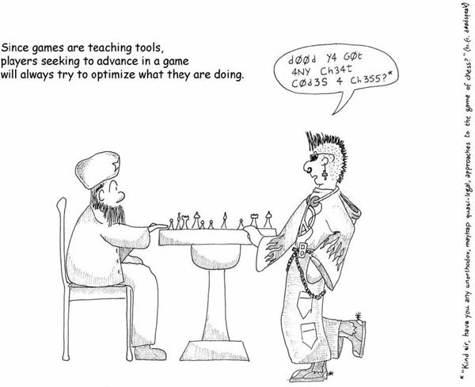
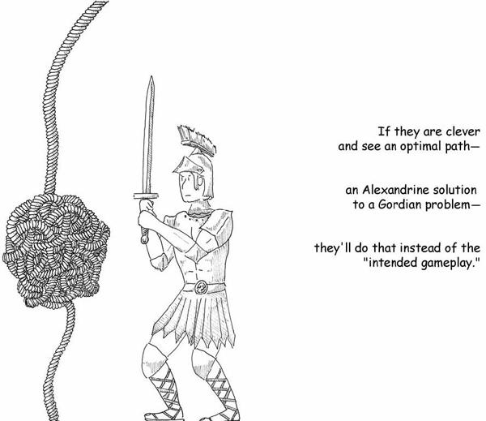
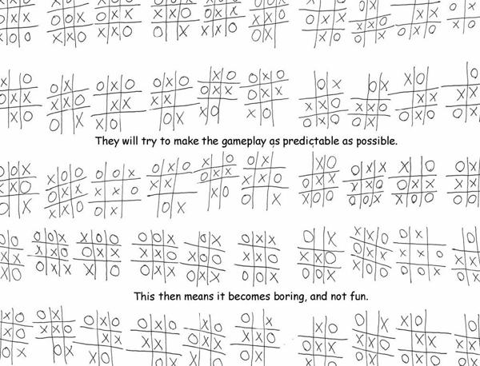
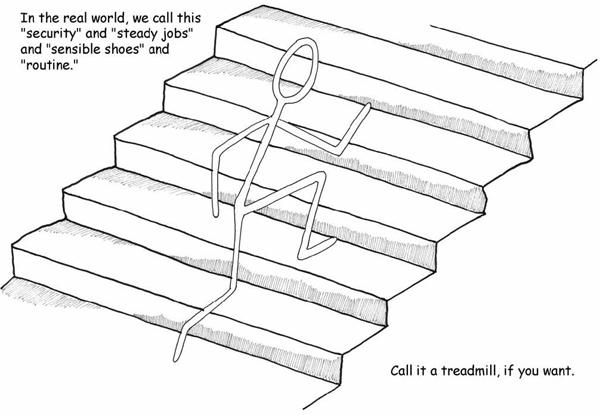
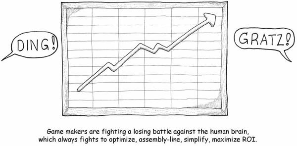
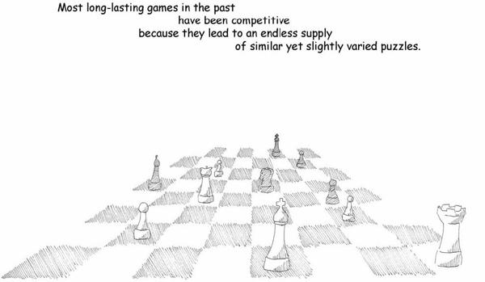
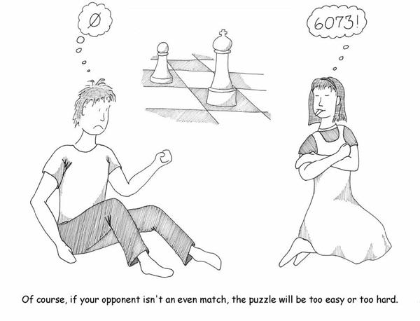
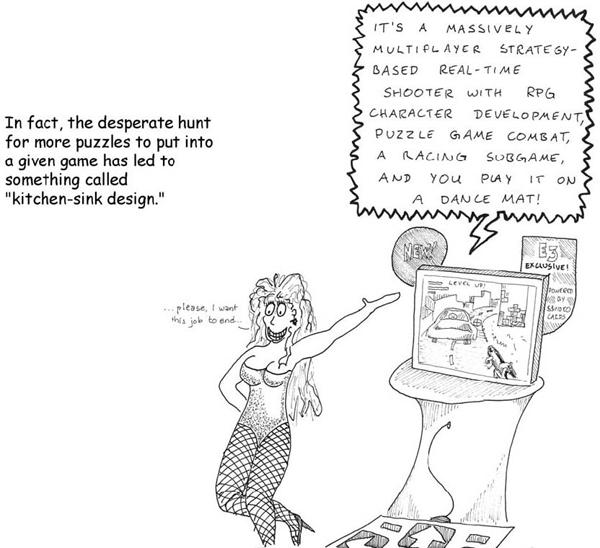

# 7. The Problem with Learning

# Chapter 7. The Problem with Learning

Learning can be problematic. For one thing, it’s kind of hard work. Our brains may unconsciously direct us to learn, but if we’re pushed by parents, teachers, or even our own logical brains, we often resist most mightily.

When I was a kid taking math classes, teachers always made us write out proofs. We were good enough at algebra where we could look at a given problem and see the answer and then write it down, but it didn’t matter—we had to actually work it out:

x2 + 5 = 30

We weren’t allowed to just write x = 5. We had to write out:

∴ x2 = 30 – 5

∴ x2 = 25

∴ x = √25

∴ x = 5

We always thought this was stupid. If we could just look at the problem and see that x = 5, why the hell couldn’t we just write it down? Why go through the pesky process? All it did was slow us down!

Of course, the good reason is that multiplying -5 by -5 is also 25, and thus there are actually two answers. Skipping to the end, we’re more likely to forget that.

That doesn’t stop the human mind from wanting to take shortcuts, however.

Once a player looks at a game and ascertains the pattern and the ultimate goal, they’ll try to find the optimal path to getting there. And one of the classic problems with games of all sorts is that players often have little compunction about violating the theoretical “magic circle” that encompasses games and makes them protected spaces in which to practice.

In other words, many players are willing to cheat.

This is a natural impulse. It’s not a sign of people being bad (though we can call it bad sportsmanship). It’s actually a sign of lateral thinking, which is a very important and valuable mental skill to learn. When someone cheats at a game, they may be acting unethical, but they’re also exercising a skill that makes them more likely to survive. It’s often called “cunning.”

Cheating is a long-standing tradition in warfare, where it is acknowledged as one of the most powerful and brilliant of all military techniques. “Let’s throw sand in our opponent’s eyes.” “Let’s attack by night.” “Let’s not charge out of the woods and ambush them instead.” “Let’s make them walk through the mud so we can shoot them full of arrows.” As one of the most important strategic adages has it, “If you cannot choose the battle, at least choose the battlefield.”

When a player cheats in a game, they are choosing a battlefield that is broader in context than the game itself.

Cheating is a sign that the player is in fact grokking the game. From a strict evolutionary point of view, cheating is a winning strategy. Duelists who shoot first while their opponent is still pacing off are far more likely to reproduce.

There’s a good reason why we instinctively and jealously preserve the notions of sportsmanship and fair play. If the lesson taught by a particular game comes up in the real world, the cheat may not work. Cheating may not prepare us correctly. This is why kicking an opponent during a soccer match is considered poor form. Whatever soccer’s underlying mechanics are teaching us, kicking an opponent is outside its formal framework.

Players and designers often make the distinction between “cheating” and “exploiting a loophole.” They always struggle to define this, but it boils down to whether or not the extraneous action is one that resides within the magic circle of the game’s framework or not. Unsurprisingly, exploiters are often the *most* expert players of a game. They see the places where the rules don’t quite jibe. This is also why they often think that it’s unfair when sticklers for the rules tell them that what they did is not allowed. Their logic goes something like “if the game permits it, then it’s legal.”

But the game is usually intended to put players through a particular challenge, and while a bad design may allow the player to circumvent the challenge, we resent it *because* it’s circumvention. It’s not exactly evidence of mastery of a technique to solve the problem. Often games are trying to teach techniques, they don’t merely give players goals and tell them to solve them any way they please.

We can rectify this to a degree via good game design (and even better, we can make games that don’t prescribe solutions—that’s a rather limited game, and it severely undermines what games are about). But in the end, we’re fighting a losing battle against a natural human tendency: to get better at things.

Consider the oddity of games that intentionally create situations that we have long since moved past in the real world: games about fighting wars with bayonets, games about sailing ships, or games about an artisan-based economy. We’ve advanced in technology, and we have cruise missiles, aircraft carriers, and factories now.

Games, however, do not permit progress. Games do not permit innovation. They present a pattern. Innovating out of a pattern is by definition outside the magic circle. You don’t get to change the physics of a game.

Human beings are *all* about progress. We like life to be easier. We’re lazy that way. We like to find ways to avoid work. We like to find ways to keep from doing something over and over. We dislike tedium, sure, but the fact is that we crave *predictability*. Our whole life is built on it. Unpredictable things are stuff like drive-by shootings, lightning bolts that fry us, smallpox, food poisoning—unpredictable things can *kill* us! We tend to avoid them. We instead prefer sensible shoes, pasteurized milk, vaccines, lightning rods, and laws. These things aren’t perfect, but they do significantly reduce the odds of unpredictable things happening to us.

And since we dislike tedium, we’ll allow unpredictability, but only inside the confines of predictable boxes, like games or TV shows. Unpredictability means new patterns to learn, therefore unpredictability is fun. So we like it, for enjoyment (and therefore, for learning). But the stakes are too high for us to want that sort of unpredictability under normal circumstances. That’s what games are for in the first place—to package up the unpredictable and the learning experience into a space and time where there is no risk.

The natural instinct of a game player is to make the game more predictable because then they are more likely to win.

This leads to behaviors like “bottom-feeding,” where a player will intentionally take on weaker opponents under the sensible logic that a bunch of sure wins is a better strategy than gambling it all on an iffy winner-take-all battle. Players running an easy level two hundred times to build up enough lives so that they can cruise through the rest of the game with little risk is the equivalent of stockpiling food for winter: it’s just *the smart thing to do*.

This is what games are *for*. They teach us things so that we can minimize risk and know what choices to make. Phrased another way, *the destiny of games is to become boring, not to be fun*. Those of us who want games to be fun are fighting a losing battle against the human brain because fun is a process and routine is its destination.

So players often intentionally suck the fun out of a game in hopes they can learn something new (in other words, find something fun) once they complete the task. They’ll do it because they perceive it (correctly) as the optimal strategy for getting ahead. They’ll do it because they see others doing it, and it’s outright unnatural for a human being to see another human being succeeding at something and not want to compete.

All of this happens because the human mind is goal driven. We make pious statements like “it’s the journey, not the destination,” but that’s mostly wishful thinking. The rainbow is pretty and all, and we may well enjoy gazing at it, but while you were gazing, lost in a reverie, someone else went and dug up the pot of gold at the end of it.

Rewards are one of the key components of a successful game activity; if there isn’t a quantifiable advantage to doing something, the brain will often discard it out of hand. What are the other fundamental components of a game element, the atoms of games, so to speak? Game designer Ben Cousins calls these “ludemes,” the basic units of gameplay. We’ve talked about several of them, such as “visit everywhere” and “get to the other side.” There are many left to discover, we hope. In the end, though, they are almost always made up of the same elementary particles.

Successful games tend to incorporate the following elements:

* **Preparation**. Before taking on a given challenge, the player gets to make some choices that affect their odds of success. This might be healing up before a battle, handicapping the opponent, or practicing in advance. You might set up a strategic landscape, such as building a particular hand of cards in a card game. Prior moves in a game are automatically part of the preparation stage because all games consist of multiple challenges in sequence.
* **A sense of space**. The space might be the landscape of a war game, a chess board, the network of relationships between the players during the bridge game.
* **A solid core mechanic**. This is a puzzle to solve, an intrinsically interesting rule set into which content can be poured. An example might be “moving a piece in chess.” The core mechanic is usually a fairly small rule; the intricacies of games come from either having a lot of mechanics or having a few, very elegantly chosen ones.
* **A range of challenges**. This is basically content. It does not *change* the rules, it operates *within* the rules and brings slightly different parameters to the table. Each enemy you might encounter in a game is one of these.
* **A range of abilities required to solve the encounter**. If all you have is a hammer and you can only do one thing with it, then the game is going to be dull. This is a test that tic-tac-toe fails but that checkers meets; in a game of checkers you start learning the importance of forcing the other player into a disadvantageous jump. Most games unfold abilities over time, until at a high levels you have many possible stratagems to choose from.
* **Skill required in using the abilities**. Bad choices lead to failure in the encounter. This skill can be of any sort, really: resource management during the encounter, failures in timing, failures in physical dexterity, and failures to monitor all the variables that are in motion.

A game having all of these elements hits the right cognitive buttons to be fun. If a game involves no preparation, we say it relies on chance. If there’s no sense of space, we call it trivial. If there’s no core mechanic, there’s no game at all. If there’s no range of challenges, we exhaust it quickly. If there’s no multiple choices to make, it’s simplistic. And if skill isn’t required, it’s tedious.

There are also some features that should be present to make the experience a learning experience:

* **A variable feedback system**. The result of the encounter should not be completely predictable. Ideally, greater skill in completing the challenge should lead to better rewards. In a game like chess, the variable feedback is your opponent’s response to your move.
* **The Mastery Problem must be dealt with**. High-level players can’t get big benefits from easy encounters or they will bottom-feed. Inexpert players will be unable to get the most out of the game.
* **Failure must have a cost**. At the very least there is an opportunity cost, and there may be more. Next time you attempt the challenge, you are assumed to come into it from scratch—there are no—“do-overs.” Next time you try, you may be prepared differently.

Looking at these elementary particles that make up ludemes, it’s easy to see why most games in history have been competitive head-to-head activities. It’s the easiest way to constantly provide a new flow of challenges and content.

Historically, competitive game-playing of all sorts has tended to squeeze out the people who *most* need to learn the skills it provides, simply because they aren’t up to the competition and they are eliminated in their first match. This is the essence of the Mastery Problem. Because of this, a lot of people prefer games that take no skill. These people are definitely failing to exercise their brains correctly. *Not requiring skill from a player should be considered a cardinal sin in game design*. At the same time, designers of games need to be careful not to make the game demand too much skill. They must keep in mind that players are always trying to reduce the difficulty of a task. The easiest way to do that is to not play.

This isn’t an algorithm for fun, but it’s a useful tool for checking for the *absence* of fun because designers can identify systems that fail to meet all the criteria. It may also prove useful in terms of game critique. Simply check each system against this list:

* Do you have to prepare before taking on the challenge?
* Can you prepare in different ways and still succeed?
* Does the environment in which the challenge takes place affect the challenge?
* Are there solid rules defined for the challenge you undertake?
* Can the rule set support multiple types of challenges?
* Can the player bring multiple abilities to bear on the challenge?
* At high levels of difficulty, does the player *have* to bring multiple abilities to bear on the challenge?
* Is there skill involved in using an ability? (If not, is this a fundamental “move” in the game, like moving one checker piece?)
* Are there multiple success states to overcoming the challenge? (In other words, success should not have a single guaranteed result.)

  
* Do advanced players get no benefit from tackling easy challenges?
* Does failing at the challenge at the very least make you have to try again?

If your answer to any of the above questions is “no,” then the game system is probably worth readdressing.

Game designers are caught in the Red Queen’s Race because challenges are meant to be surmounted. The result is that modern game designers have often taken the approach of piling more and more different types of challenges into one game. The number of ludemes reaches astronomical proportions. Consider that checkers consists of exactly two: “capture all the pieces” and “move one piece.” Now compare that to the last console game you saw.

Most classic games consist of relatively few systems that fit together elegantly. The entire genre of abstract strategy games is about elegant choice of ludemes. But in today’s world, many of the lessons we might want to teach might require highly complex environments and many moving parts—online virtual worlds spring to mind as an obvious example.

The lesson for designers is simple: A game is destined to become boring, automated, cheated, and exploited. Your sole responsibility is to know what the game is about and to ensure that the game teaches that thing. That one thing, the theme, the core, the heart of the game, might require many systems or it might require few. But *no system should be in the game that does not contribute toward that lesson*. It is the cynosure of all the systems; it is the moral of the story; it is the point.

In the end, that is both the glory of learning and its fundamental problem: Once you learn something, it’s over. You don’t get to learn it again.

