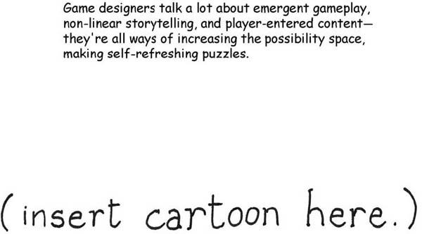
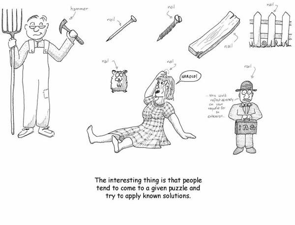
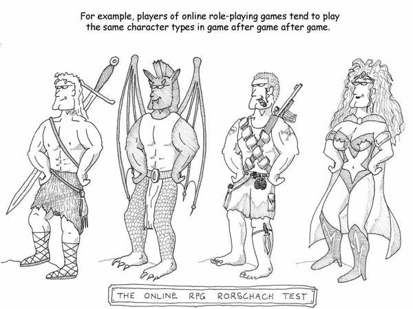
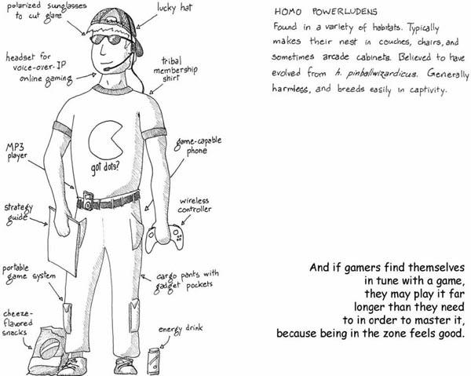
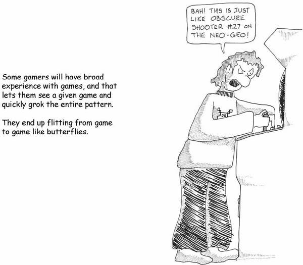
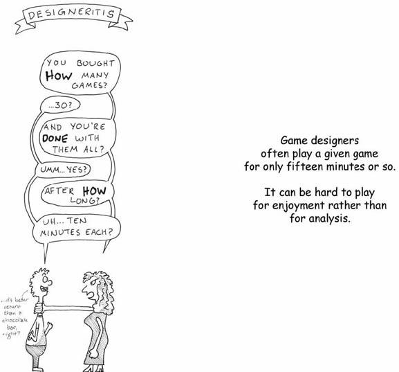

# 8. The Problem with People

# Chapter 8. The Problem with People

The holy grail of game design is to make a game where the challenges are never ending, the skills required are varied, and the difficulty curve is perfect and adjusts itself to exactly our skill level. Someone did this already, though, and it’s not always fun. It’s called “life.” Maybe you’ve played it.

That hasn’t stopped us from trying all sorts of tactics to make games self-refreshing. You see, designing rule sets and making all the content is hard. Designers often feel proudest of designing good abstract systems that have deep self-generating challenges—games like chess and go and *Othello* and so on.

* **“Emergent behavior”** is a common buzzword. The goal is new patterns that emerge spontaneously out of the rules, allowing the player to do things that the designer did not foresee. (Players do things designers don’t expect *all the time*, but we don’t like to talk about it.) Emergence has proven a tough nut to crack in games; it usually makes games easier, often by generating loopholes and exploits.
* **We also hear a lot about storytelling**. It’s easier to construct a story with multiple possible interpretations than it is to construct a game with the same characteristics. However, most games melded with stories tend to be Frankenstein monsters. Players tend to either skip the story or skip the game.
* **Placing players head-to-head** is also a common tactic, on the grounds that other players are an endless source of new content. This is accurate, but the Mastery Problem rears its ugly head. Players hate to lose. If you fail to match them up with an opponent who is very precisely of their skill level, they’ll quit.
* **Using players to generate content** is a useful tactic. Many games expect players to supply the challenges in various ways, ranging from making maps for a shooter game to contributing characters in a role-playing game.

But is this futile? I mean, all these designers are trying to expand the possibility space… …and all the players are trying to reduce it, just as fast as they can. You see, humans are wired in some interesting ways. If something has worked for us before, we’ll tend to do it again. We’re really very resistant to learning. We’re conservative at heart, and we grow more so as we age. You’ve perhaps heard the old saw, variously attributed to Clemenceau, Churchill, and Bismarck, “If a man isn’t liberal when he’s 20, he has no heart. If he’s not conservative when he’s 40, he has no brain.” Well, there’s a lot of truth to this. We grow more resistant to change as we age, and we grow less willing (and able) to learn.

If we come across a problem we have encountered in the past, our first approach is to try the solution that has worked before, even if the circumstances aren’t exactly the same.

The problem with people isn’t that they work to undermine games and make them boring. That’s the natural course of events. The real problem with people is that

> …even though our brains feed us drugs to keep us learning…
>
> …even though from earliest childhood we are trained to learn through play…
>
> …even though our brains send incredibly clear feedback that we should learn throughout our lives…
>
> **PEOPLE ARE LAZY**.

Look at the games that offer the absolute greatest freedom possible within the scope of a game setting. In role-playing games there are few rules. The emphasis is on collaborative storytelling. You can construct your character any way you want, use any background, and take on any challenge you like.

And yet, people choose the *same* characters to play, over and over. I’ve got a friend who has played the big burly silent type in literally dozens of games over the decade I have known him. Never once has he been a vivacious small girl.

Different games appeal to different personality types, and not just because particular problems appeal to certain brain types. It’s also because particular *solutions* appeal to particular brain types, and when we’ve got a good thing going, we’re not likely to change it. This is not a recipe for long-term success in a world that is constantly changing around us. Adaptability is key to survival.

Much is made of cross-gender role-play in online settings. When you look at it in this light, it’s clearly because a given gender presentation is a *solution choice*—a tool the player is using to solve problems presented by the online setting. It might be because the gender presentation is a good way to meet like-minded people. Males choosing female avatars may be signaling something about their preference for the company of other empathizing brains, for example.

Sticking to one solution is not a survival trait anymore. The world is changing very fast, and we interact with more kinds of people than ever before. The real value now lies in a wide range of experiences and in understanding a wide range of points of view. Closed-mindedness is actively dangerous to society because it leads to misapprehension. And misapprehension leads to misunderstanding, which leads to offense, which leads to violence.

Consider the hypothetical case where every player of an online role-playing game gets exactly two characters: one male and one female. Would the world be more or less sexist as a result?

Another case where the wiring of the human brain tends to betray us lies in the seductive feeling of make-believe mastery.

Engaging in an activity that you have fully mastered, being in the zone, feeling the flow, can be a heady experience. And no one can deny the positive effects of meditation. That said, the point at which a player chooses to repeatedly play a game they have already mastered completely, just because they like to feel powerful, is the point at which the game is betraying its own purpose. Games need to encourage you to *move on*. They are not there to fulfill power fantasies.

Ah, but is it seductive! Because games exist within the confines of “let’s pretend,” they also offer a lack of consequences. They are libertine in their freedoms. They let you be a godlet. To the person that perhaps does not get enough sense of control in their real lives, the game may offer something rather…persuasive.

Making you feel good about yourself in a pretend arena isn’t what games are for. Games are for offering challenges, so that you can then turn around and apply those techniques to real problems. Going back through defeated challenges in order to pass time isn’t a productive exercise of your brain’s abilities. Nonetheless, lots of people do it.

Some choose to play for “style points,” which is at least a sign that they are creating new challenges for themselves. But once you get past the point of doing something perfectly, do yourself a favor and *quit the game*.

There are other sorts of audience problems with games. One of them has proven fatal to many genres of games: the problem of increasing complexity. Most art forms have swung in pendulum fashion from an Apollonian to a Dionysian style—meaning, they have alternated between periods where they were reserved and formal and where they were exuberant and communicative. From Romanesque to Gothic churches, from art rock to punk, from the French Academy to Impressionism, pretty much every medium has had these swings.

Games, however, are always formal. The historical trend in games has shown that when a new genre of game is invented, it follows a trajectory where increasing complexity is added to it, until eventually the games on the market are so complex and advanced that newcomers can’t get into them—the barrier of entry is too high. You could call this the jargon factor because it is common to *all* formal systems. Priesthoods develop, terms enter common usage, and soon only the educated few can hack it.

In most media, the way out of this has been the development of a new formal principle (as well as a cultural shift). Sometimes it was a development in knowledge of the form. Sometimes it was the development of a competing medium that usurped the place of the old medium, as when photography forced painters to undergo a radical reevaluation of their art form. Games, though, aren’t tending to do this all that much. By and large, we have seen an inexorable march toward greater complexity. This has led to a priesthood of those who can speak the language, master the intricacies, and keep up-to-date.

Every once in a while games come along that appeal to the masses, and thank goodness. Because frankly, priesthoods are a perversion of what games are about as well. The worst possible fate for games (and by extension, for our species) would be for games to become niche, something played by only a few elite who have the training to do so. It was bad for sports, it was bad for music, it was bad for writing, and it would be bad for games as well.

Conversely, it’s possible that instead games are like the Twonky from the famous science fiction story. Maybe the kids will keep up, and the older people won’t be able to. And then we’ll get left behind…

All of these are cases where human nature works against the success of games as a medium and as a teaching tool. Ironically, these all converge most sharply in the most unlikely of candidates, the person who loves games more than anyone: the game designer.

Game designers spend less time playing individual games than the typical player does. Game designers finish games less often than typical players do. They have less time to play a given game because they typically sample so many of them. And perniciously, they are just as likely, if not more so because of business pressures, to turn to known solutions.

Basically, game designers suffer from what I call “designeritis.” They are hypersensitive to patterns in games. They grok them very readily and move on. They see past fiction very easily. They build up encyclopedic recollections of games past and present, and they then theoretically use these to make new games.

But they usually *don’t* make new games because their very experience, their very library of assumptions, holds them back. Remember what the brain is doing with these chunks it builds—it is trying to create a generically applicable library of solutions. The more solutions you have stored up, the less likely you are to go chasing after a new one.

The result has been, as you would expect, a lot of derivative work. Yes, you need to know the rules in order to break them, but given the lack of codification and critique of what games are, game designers have instead operated under the more guildlike model of apprenticeship. They do what they have seen work.

The most creative and fertile game designers working today tend to be the ones who make a point of *not* focusing too much on other games for inspiration. Creativity comes from cross-pollination, not the reiteration of the same ideas. By making gaming their hobby, game designers are making an echo chamber of their own work. Because of this, it is critical that games be placed in context with the rest of human endeavor so that game designers can feel comfortable venturing outside their field in search of innovative ideas.

[*OceanofPDF.com*](https://oceanofpdf.com)
