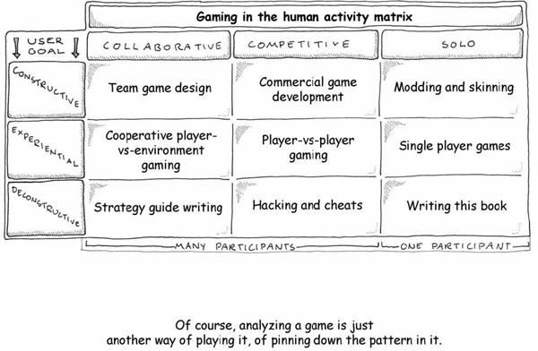
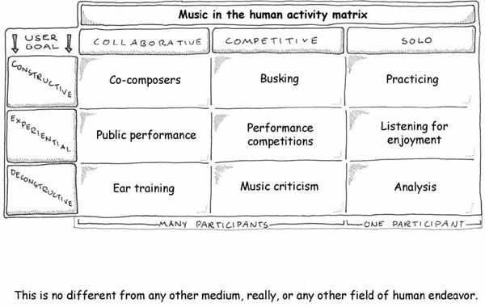
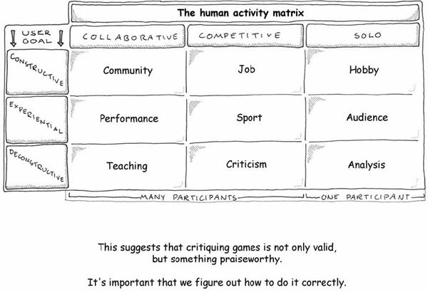
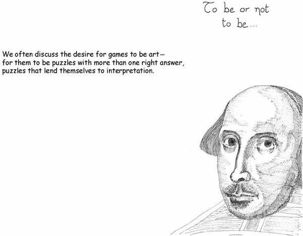
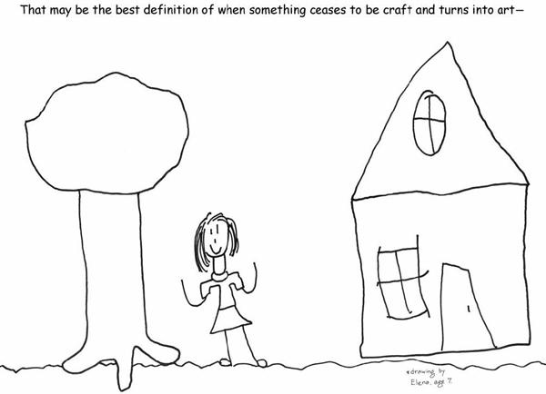
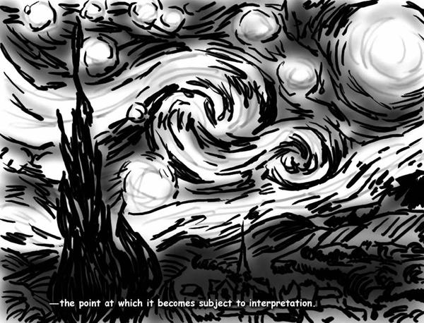
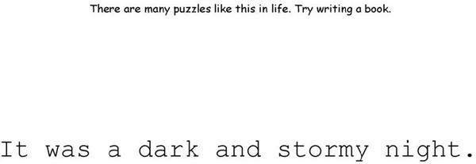
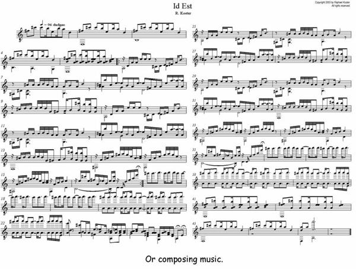
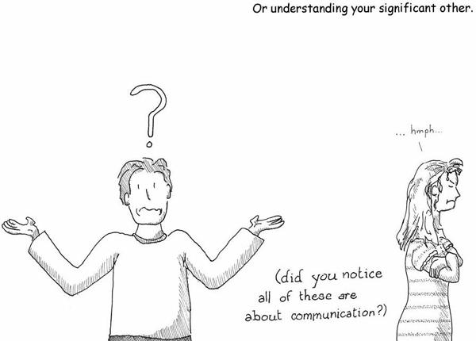

# 9. Games in Context

# Chapter 9. Games in Context

Game designers are doing something that really isn’t their job—they are evolving game design into a discipline. And it’s a good thing that they are doing it. This has been happening slowly over the past few decades and particularly in the past 10 years.

I don’t necessarily mean they are becoming all scientific about it. But we have seen the following: a large increase in the number of books about game design, the beginnings of a critical vocabulary, and the creation of academic programs that attempt to engage in critique. In short, the field has started to move away from the hit-and-miss shots-in-the-dark approach and toward an understanding of what games are and how they work. This is an important final step in the maturation process of a medium.

On the facing pages where you usually see what are hopefully amusing cartoons, I’ve filled out a few grids with different human endeavors. Bear with me—there are two sorts of people in this world, those who divide everyone into two sorts of people and those who don’t.

Any given activity can be performed either by yourself or with others. If you are doing it with others, you can be working either with or against each other. I call these three approaches *collaborative, competitive*, and *solo*.

Down the side of our grid, I’ve made a subtler distinction. Are you a passive consumer of this activity? An audience member? Or do you actively work on the activity? If you are someone who doesn’t work on the activity but instead lets the work of others wash over you, we’ll call you interested in the *experiential* side of the activity—you want the experience.

Are you actually *creating* the experience? Then you are engaging in a *constructive* activity. Maybe instead, you are taking the experience apart, to see how it works. I used to label this destructive, but it’s not really; often the original is left behind, intact though somewhat bruised and battered. So perhaps *deconstructive* is a better term.

My second grid shows how we can analyze music. When I look at the chart for music, what I see is a constellation of music-based entertainment. If I made a similar chart for books, it would cover prose-based entertainment. Basically, this chart can be applied to any *medium*.

“Game” is not a medium, even though I have misused it that way on almost every page of this book. It is, depending on the definition, one *use* of a medium. The medium is really an unwieldy phrase like “formal abstract models for teaching patterns.” And once you see that, you see that even though fire drills or CIA model war games of the future of the Middle East may not necessarily be fun, they still belong on the chart. The fact that they are not fun has more to do with their implementation than with their intrinsic nature.

Interaction is possible in all media. Interacting with stage-based media is termed “acting” and interacting with prose-based media is termed “writing.” There’s been a lot of discussion in professional video game design circles lately about “the surrender of authorship” inherent in adding greater flexibility to games and in the burgeoning “mod” community. I think the key insight here is that players are simply “interacting with the medium.”

In other words, modding is just playing the game in another way, sort of like a budding writer might rework plots of characters from other writers into derivative journeyman fiction or into fan fiction. The fact that some forms of it are constructive (modding a game), experiential (playing a game), or deconstructive (hacking a game) are immaterial; the same activities are possible with a given play, book, or song. Arguably, the act of literary analysis is much the same as the act of hacking a game—the act of disassembling the components of a given piece of work in a medium to see how it works, or even to get it to do things, carry messages, or otherwise represent itself as something other than what the author of the piece intended.

Some of the activities on the first chart aren’t what you would normally term “fun,” even though they are almost all activities in which you learn patterns. We can sit here and debate whether performing music, writing a story, or drawing a picture is fun. From having training in all three, I can tell you that they are all hard work, which isn’t something we necessarily consider fun. But I derive great fulfillment from these activities. This is perhaps analogous to watching *Hamlet* on stage, reading *Lord Jim*, or viewing *Guernica*—not exactly giggly-happy-fun, but fulfilling in a different way.

The chills that go down your back are not always indicative of something that you find enjoyable. A tragedy or moment of great sorrow can cause them. The moment you recognize a pattern your body will give you the chill as a sign. Just as writing isn’t necessarily fun but might be something valuable for the writer to do, or practicing piano for hours on end might not be fun but something that gives fulfillment, engaging in interaction with games need not be fun either but might indeed be fulfilling, thought-provoking, challenging, and also difficult, painful, and even compulsive.

In other words, games can take forms we don’t recognize. They might not be limited to being “a game” or even a “software toy.” The definition of “game” implies certain things, as do the words “toy,” “sport,” and “hobby.” The classic definition of “game” covers only some of the boxes in the grid. Arguably, all of the boxes in the grid are fun to *someone*. We need to start thinking of games a little more broadly. Otherwise, we will be missing out on large chunks of their potential as a medium.

The reason why the rise of critique and academia surrounding games is important is because it finally adds the missing element to put games in context with the rest of human endeavor. It means their arrival as a medium. Considering how long they have been around, they’re a little late to the party.

Once games are seen as a medium, we can start worrying about whether they are a medium that permits art. All other media do, after all.

Pinning art down is tricky. We can start from the basics, though. What is art for? Communicating. That’s intrinsic to the definition. And (if you’ve bought into the premises of this book) we have seen that the basic intent of games is rather communicative as well—it is the creation of a symbolic logic set that conveys meaning.

Some apologists for games like to tout the fact that games are interactive as a sign that they are special. Others like to say that interactivity is precisely why games cannot be art, because art relies on authorial intent and control. Both positions are balderdash. Every medium is interactive—just go look on the grid.

So what is art? My take on it is simple. Media provide information. Entertainment provides comforting, simplistic information. And art provides challenging information, stuff that you have to think about in order to absorb. That’s it. Art uses a particular medium to communicate within the constraints of that medium, and often what is communicated is thoughts *about* the medium itself (in other words, a formalist approach to arts—much modern art falls in this category).

The medium shapes the nature of the message, of course, but the message can be representational, impressionistic, narrative, emotional, intellectual, or whatever else. Some art forms are solo, and some are collaborative (and they can all be made collaborative to an extent, I believe). And some media are actually the result of the collaboration of specialists in many different media, working together to present a work that is incomplete without the use of multiple media within it. Film is one such medium. And games are another.

One of the commonest points I hear about why video games are not an art form is that they are just for fun. They are just entertainment. Hopefully I’ve made it clear why that is a dangerous underestimation of fun. But most music is also just entertainment, and most novels are read just for fun, and most movies are mere escapism, and yes, even most pretty pictures are just pretty pictures. The fact that most games are merely entertainment does not mean that this is all they are doomed to be.

Mere entertainment becomes art when the communicative element in the work is either novel or exceptionally well done. It really is that simple. The work has the power to alter how people perceive the world around them. And it’s hard to imagine a medium more powerful in that regard than video games, where you are presented with interactivity and a virtual world that reacts to your choices.

“Well done” and “novel” mean, basically, craft. You can have well-crafted entertainment that fails to reach the level of art. The upper reaches of art are usually subtler achievements. They are pieces of work that you can return to again and again and keep learning something new. The analogy for a game would be one you can replay over and over again and keep discovering new things.

Since games are closed formal systems, that might mean that games can never be art in that sense. But I don’t think so. I think that means that we just need to decide what we want to say with a given game—something big, something complex, something open to interpretation, something where there is no single right answer—and then make sure that when the player interacts with it, they can come to it again and reveal whole new aspects to the challenge presented.

What would a game like this be?

It would be thought-provoking.

It would be revelatory.

It might contribute to the betterment of society.

It would force us to reexamine assumptions.

It would give us different experiences each time we tried it.

It would allow each of us to approach it in our own ways.

It would forgive misinterpretation—in fact, it might even encourage it.

It would not dictate.

It would immerse, and impose a worldview.

Some might say that abstract formal systems cannot achieve this. But I have seen wind course across the sky, bearing leaves; I have seen paintings by Mondrian made of nothing but colored squares; I have heard Bach played on a harpsichord; I have traced the rhythms of a sonnet; I have trod in the steps of a dance. All media are abstract, formal systems. Let’s not sell abstraction and formality short.

In fact, the toughest puzzles are the ones that force the most self-examination. They are the ones that challenge us most deeply on many levels—mental stamina, mental agility, creativity, perseverance, physical endurance, and emotional self-abnegation. They come precisely from the interactive portions of the chart, when you look at other media.

Consider the act of creation.

It’s one of the toughest things to do and do well, in human endeavor. And yet it is also one of our most instinctive actions; from a young age, we not only trace patterns but attempt to create new ones. We scribble with crayons, we ba-ba-ba our way through songs.

The fact that playing games—good ones, anyway—is fundamentally a creative act is something that speaks very well for the medium. Games, at their best, are not prescriptive. They demand that the user create a response given the tools at hand. It is a lot easier to fail to respond to a painting than to fail to respond to a game.

No other artistic medium defines itself around an intended *effect* on the user, such as “fun.” They all embrace a wider array of emotional impact. Now, we may be running into definitional questions for the word “fun” here, obviously, but even so, I’d prefer to approach things from a more formalist perspective to actually arrive at what the basic building blocks of the medium are. From a formalist point of view, music can be considered ordered sound and silence, and poetry can be considered the placement of words and gaps between words, and so on.

The closer we get to understanding the basic building blocks of games, the things that players and creators alike manipulate in interacting with the medium, the more likely we are to achieve the heights of art.

Some folks disagree with me pretty vehemently on this. They feel that the art of the game lies in the formal construction of systems. The more artfully constructed the system is, the closer the game is to art.

Putting games in context with other media demands that we consider this viewpoint. In literature, it’s called a *belles-lettristic* point of view. The beauty of poetry lies solely in the sound and not in the sense, according to those who feel this way.

And yet, even the shape of the sound can be put in context. Let’s digress and consider some other media…

Impressionism is not concerned with giving impressions, but rather with a more distanced form of seeing, of mimesis. Modern image processing tools describe the Impressionist formal process (and indeed many of the later processes such as posterization) as *filters*—an accurate description in that Impressionist paintings are depictions not of an object or a scene, but of the play of light upon said object or scene. In such representations, you still must conform to all previously established rules of composition—color weight, balance, vanishing point, center of gravity, eye center, and so on—while essentially avoiding painting the object or scene itself, which ends up being absent from the finished work.

Impressionist music was based primarily on repetition; its influence on later minimalist styles is clear. However, where minimalism also restricts its harmonic vocabulary, often to just a few essential chords (tonic, dominant, subdominant, perhaps a few extensions or substitutions thereof), Impressionist music is essentially that of Debussy: intensely varied in orchestration, extremely complex, particularly in its chromatic harmonies, and nonetheless very repetitive melodically. Ravel’s work as an orchestrator is perhaps the epitome of the Impressionistic style: his “Bolero” consists of the same passage played over and over, identical harmonically and melodically; it has merely been orchestrated differently at each repetition, and the dynamics are different. The sense of crescendo throughout the piece is achieved precisely though this repetition.

And of course, there was “Impressionist” writing. Virginia Woolf, Gertrude Stein, and many other writers worked with the idea that characters are unknowable. Books like *Jacob’s Room* and *The Autobiography of Alice B. Toklas* play with the established notions of self and work toward a realization that other people are essentially unknowable. However, they also propose an alternate notion of knowability: that of “negative space,” whereby a form is understood and its nature grasped by observing the perturbations around it. The term is from the world of pictorial art, which provides many useful insights when discussing the problem of mimesis.

All of these are organized around the same principles; that of negative space, that of embellishing the space around a central theme, of observing perturbations and reflections. There was a zeitgeist, it is true, but there was also conscious borrowing from art form to art form, and it occurs in large part because no art form stands alone; they bleed into one another.

Can you make an Impressionist game? A game where the formal system conveys the following?

* The object you seek to understand is not visible or depicted.
* Negative space is more important than shape.
* Repetition with variation is central to understanding.

The answer is, of course you can. It’s called *Minesweeper*.

In the end, the endeavor that games engage in is not at all dissimilar to the endeavors of any other art form. The principal difference is not the fact that they consist of formal systems. Look at the following lists:

* Meter, rhyme, spondee, slant rhyme, onomatopoeia, caesura, iamb, trochee, pentameter, rondel, sonnet, verse
* Phoneme, sentence, accent, fricative, word, clause, object, subject, punctuation, case, pluperfect, tense
* Meter, fermata, key, note, tempo, coloratura, orchestration, arrangement, scale, mode
* Color, line, weight, balance, compound, multiply, additive, refraction, closure, model, still life, perspective
* Rule, level, score, opponent, boss, life, power-up, pick-up, bonus round, icon, unit, counter, board

Let’s not kid ourselves—the sonnet is caged about with as many formal systems as a game is.

If anything, the great irony about games, put in context with other media, is that they may afford less scope to the designer, who has less freedom to impose, less freedom to propagandize. Games are not good at conveying specifics, only generalities. It is easy to make a game that tells you that small groups can prevail over large ones, or the converse. And that may be a valuable and deeply personal statement to make. It’s a lot harder to make a game that conveys the specific struggle of a group of World War II soldiers to rescue one other man from behind enemy lines, as the film *Saving Private Ryan* does. The designer who wants to use game design as an expressive medium must be like the painter and the musician and the writer, in that they must learn what the strengths of the medium are, and what messages are best conveyed by it.

