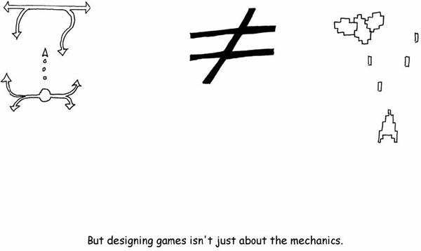
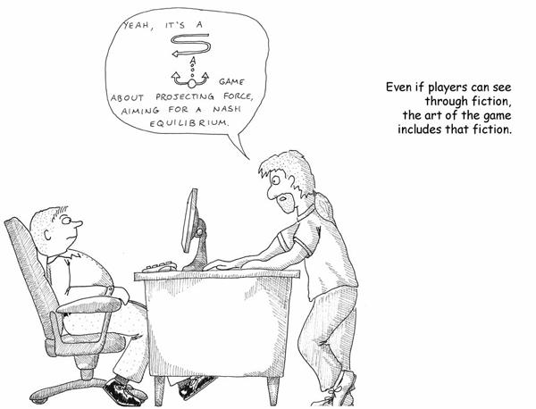
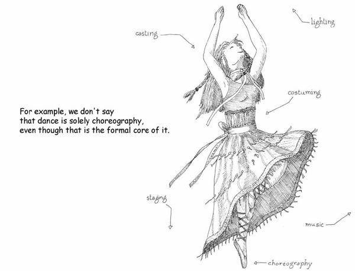
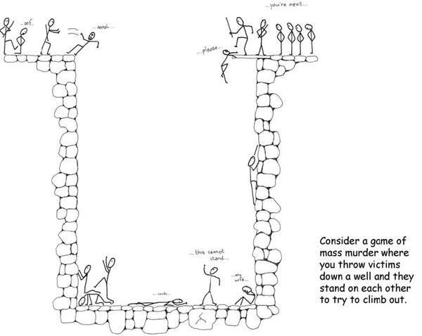
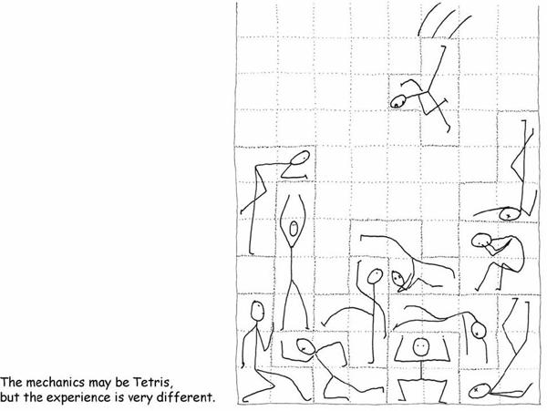
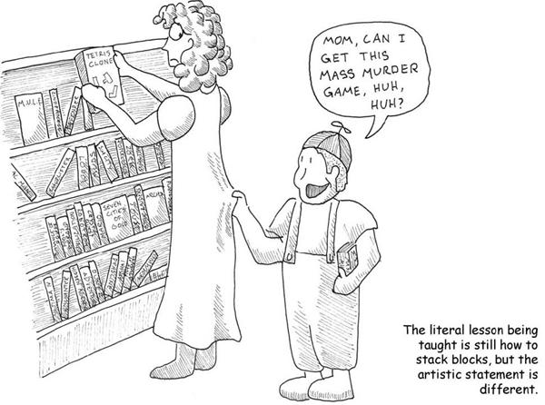

# 10. The Ethics of Entertainment

# Chapter 10. The Ethics of Entertainment

Nobody actually interacts with games on an abstract level exclusively. You don’t play the abstract diagrams of games that I have drawn on the facing pages; you play the ones that have little spaceships and laser bolts and things that go Boom. The core of gameplay may be about the emotion I am terming “fun,” the emotion that is about learning puzzles and mastering responses to situations, but this doesn’t mean that the other sorts of things we lump under fun do not contribute to the overall experience.

People like playing go using well-burnished beads on a wooden board and they like buying *Lord of the Rings* chess sets and glass Chinese checkers sets. The aesthetic experience of playing these games matters. When you pick up a well-carved wooden game piece, you respond to it in terms of aesthetic appreciation—one of the other forms of enjoyment. When you play table tennis against an opponent, you feel visceral sensations as you stretch your arm to the limit and smash the ball against the table surface. And last, when you slap the back of your teammate, congratulating him on his field goal, you’re participating in the subtle social dance that marks the constant human exercise of social status.

We know this about other media. It matters who sings a song because delivery is important. We treasure nice editions of books, rather than cheap ones, even though the semantic content is identical. Rock climbing a real rock face, versus a fake one attached to a wall, feels different.

In many media, the presentation factors are outside the hands of the initial creator of the content. But in other media, the creator has a say. Often, we have a specific person whose role it is to create the overall experience as opposed to the content itself. And rightfully, this person is given higher authority over the final output than the content creator alone. The director trumps the writer in a movie, and the conductor trumps the composer in a symphony.

There is a difference between designing the content and designing the end-user *experience*.

In most cases, we haven’t reached this realization in game design. Game design teams are not set up this way. Nonetheless, it’s an inevitable development in the medium. Too many other components have tremendous importance in our overall experience of games for their overall shape to rest in the hands of the designer of formal abstract systems alone.

Players see through the fiction to the underlying mechanics, but that does not mean the fiction is unimportant. Consider films, where the goal is typically for the many conventions, tricks, and mind-shapings that the camera performs to remain invisible and unperceived by the viewer. It’s rare that a film tries to call attention to the gymnastics of the camera, and when it does, it will likely be to make some specific point. There are many techniques used by the director and the cinematographer, such as framing the shot of a conversation from slightly over the shoulder of the interlocutor to create a sense of psychological proximity, that are used transparently, without the viewer noticing, because they are part of the vocabulary of cinema.

For better or worse, visual representation and metaphor are part of the vocabulary of games. When we describe a game, we almost never do so in terms of the formal abstract system alone—we describe it in terms of the overall experience.

The dressing is tremendously important. It’s very likely that chess would not have its long-term appeal if the pieces all represented different kinds of snot.

When we compare games to other art forms that rely on multiple disciplines for effect, we find that there are a lot of similarities. Take dance, for example. The “content creator” in dance is called the choreographer (it used to be called the “dancing master,” but modern dance disliked the old ballet terms and changed it). Choreography is a recognized discipline. For many centuries, it struggled, in fact, because there was no notation system for dance. That meant that much of the history of this art form is lost to us because there was simply no way to replicate a dance save by passing it on from master to student.

And yet, the choreographer is not the ultimate arbiter in a dance. There are far too many other variables. There’s a reason, for example, why the prima ballerina is such an important figure. The dancer makes the dance, just as the actor makes the lines. A poor delivery means that the experience is ruined—in fact, if the delivery is poor enough, the *sense* may be ruined, just as bad handwriting obscures the meaning of a word.

*Swan Lake* staged on the shore of a lake is a different experience from *Swan Lake* on a bare stage. There’s a recognized profession there too—the set designer. And there’s the lighting, the casting, the costuming, the performance of the music…. The choreographer may be the person who creates the dance, but in the end, there’s probably a director who creates the *dance*.

Games are the same way. We could probably use new terminology for games. Often in large projects, we make the distinction between game system designers, content designers, the lead designer or creative director (a problematic term because it means something else in different disciplines, such as in graphic design), writers, level designers, world builders, and who knows what else. If we consider games to be solely the design of the formal abstract systems, then only the system designer is properly a game designer. If we come up with a new term for the formal core of games, comparable to “choreography,” then we’d give this person a title derived from that term instead.

All of this implies that a mismatch between the core of a game—the ludemes—and the dressing can result in serious problems for the user experience. It also means that the right choice of dressing and fictional theme can strongly reinforce the overall experience and make the learning experience more direct for players.

The bare mechanics of a game may indeed carry semantic freighting, but odds are that it will be fairly abstract. A game about aiming is a game about aiming, and there’s no getting around that. It’s hard to conceive of a game about aiming that isn’t about shooting, but it has been done—there are several games where instead of shooting bullets with a gun, you are instead shooting pictures with a camera.

For games to really develop as a medium, they need to further develop the ludemes, not just the dressing. By and large, however, the industry has spent its time improving the dressing. We have better and better graphics, better back stories, better plots, better sound effects, better music, more fidelity in the environments, more types of content, and more systems within each game. But the systems themselves tend to see fairly little innovation.

It’s not that progress along these other axes isn’t merited—it’s just *easy* relative to the true challenge, which is developing the formal structure of games themselves. Often these new developments improve the overall experience, but that’s comparable to saying that the development of the 16-track recorder revolutionized songwriting. It didn’t; it revolutionized arranging and production, but the demo versions of songs are still usually one person with a piano or a guitar.

The best test of a game’s fun in the strict sense will therefore be playing the game with no graphics, no music, no sound, no story, no nothing. If that is fun, then everything else will serve to focus, refine, empower, and magnify. But all the dressing in the world can’t change iceberg lettuce into roast turkey.

This means the question of ethical responsibility rears its head. The ethical questions surrounding games as murder simulators, games as misogyny, games as undermining of traditional values, and so on are *not aimed at games themselves*. They are aimed at the *dressing*.

To the designer of formal abstract systems, these complaints are always going to seem misguided. A vector of force and a marker of territory have no cultural agenda. At the least, the complaints are misdirected—they *ought* to go to the equivalent of the director, the person who is making the call on the overall user experience.

Directing these complaints to the director is the standard. It’s the standard to which we hold the writers of fiction, the makers of films, the directors of dances, and the painters of paintings. The cultural debate over the acceptable limits of content is a valid one. We all know that there is a difference in experience caused by presentation. If we consider the art of the dance to be the sum of choreography plus direction plus costuming and so on, then we must consider the art of the game to be the ludemes plus direction plus artwork and so on.

The bare mechanics of the game do not determine its semantic freight. Let’s try a thought experiment. Let’s picture a mass murder game wherein there is a gas chamber shaped like a well. You the player are dropping innocent victims down into the gas chamber, and they come in all shapes and sizes. There are old ones and young ones, fat ones and tall ones. As they fall to the bottom, they grab onto each other and try to form human pyramids to get to the top of the well. Should they manage to get out, the game is over and you lose. But if you pack them in tightly enough, the ones on the bottom succumb to the gas and die.

I do not want to play this game. Do you? Yet it is *Tetris*. You could have well-proven, stellar game design mechanics applied toward a quite repugnant premise. To those who say the art of the game is purely that of the mechanics, I say that film is not solely the art of cinematography or scriptwriting or directing or acting. The art of the game is the whole.

This does not mean that the art of the cinematographer (or ludemographer) is less; in truth, the very fact that the art of the film fails if *any* of its constituent arts fail elevates each and every one to primacy.

The danger is philistinism. If we continue to regard games as trivial entertainments, then we will regard games that transgress social norms as obscene. Our litmus test for obscenity centers on redeeming social value, after all. There is no doubt that the dressing of games may or may not have any redeeming social value. But it is important to understand that the ludemes themselves can have social value. By that standard, all good games should pass the litmus test regardless of their dressing.

Creators in all media have a social obligation to be responsible with their creations. Consider the recent development of “hate crime shooters,” where the enemies represent an ethnic or religious group that the creators dislike. The game mechanic is old and tired and offers nothing new in this case. We can safely consider this game to be hate speech, as it was almost certainly intended.

The problematic case is a game that contains both brilliant gameplay and offensive content. The commonest defense is to argue that games do not exert significant influence on their players. This is untrue. *All* media exert influence on their audiences. But it is almost always the *core* of the medium that exerts the most influence because the rest is, well, dressing.

All artistic media have influence, and free will also has a say in what people say and do. Games right now seem to have a very narrow palette of expression. But let them grow. Society should not do something stupid like the Comics Code, which stunted the development of the comics medium severely for decades. Not all artists and critics agree that art has a social responsibility. If there was such agreement, there wouldn’t be the debates about the ethics of locking up Ezra Pound, about the validity of propagandistic art, about whether one should respect artists who were scoundrels and scum in their private lives. It’s not surprising that we wonder whether games or TV or movies have a social responsibility—once upon a time we asked the same thing about poetry. Nobody really ever agreed on an answer.

The constructive thing to do is to push the boundary gently so that it doesn’t backfire. That’s how we got *Lolita* and *Catcher in the Rye*, how we got *Apocalypse Now*. As a medium, we have to earn the right to be taken seriously.

