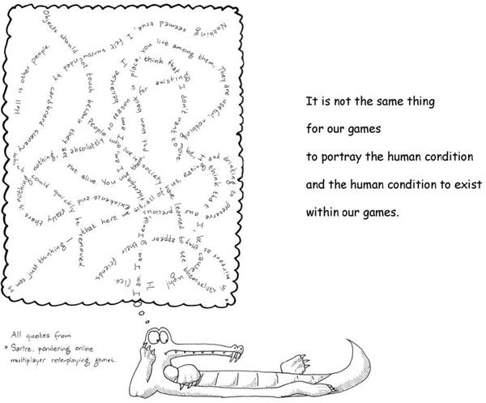
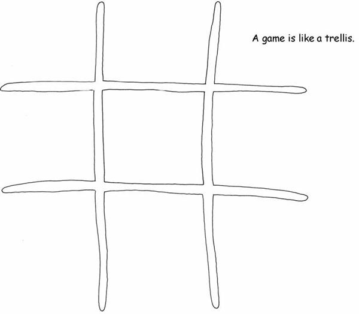
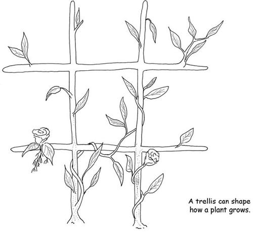
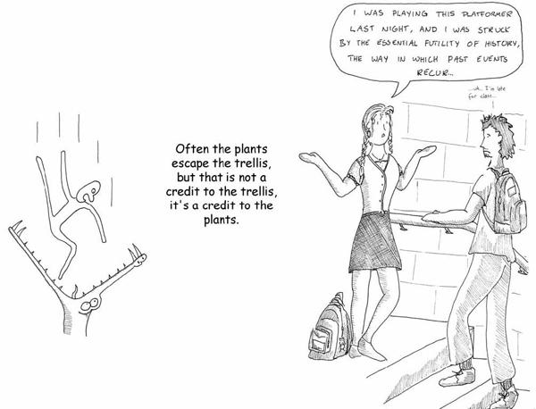
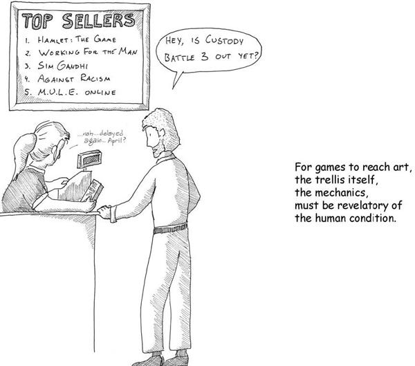
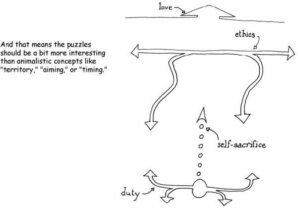

# 11. Where Games Should Go

# Chapter 11. Where Games Should Go

I’ve spent a lot of time talking about how games intersect the human condition. I think there is an important distinction to be drawn, however. In other media, we frequently speak of how a given work is revelatory of the human condition. By this, we mean that the work is a good portrayal of the human condition—it is something that gives us insight into ourselves. As the Greeks put it, *gnothi seauton*—know thyself. It’s perhaps the greatest challenge we as humans face, and in many ways, it may be the greatest threat to our survival.

Many of the things that I have discussed in this book, such as theories of cognition, understanding of gender, learning styles, chaos theory, graph theory, and literary criticism, are fairly recent developments in human history. Humanity is engaged in a grand project of self-understanding, and most of the tools we have used in the past were imprecise at best. Over time we have developed better tools at a glacial pace in the quest to understand ourselves better.

It’s an important endeavor because other humans have typically been our greatest predator. Today we have come to realize how interrelated we all are even though the left continent doesn’t know what the right continent is doing. We have come to realize that actions we undertake often have far-reaching consequences that we never anticipated. Some, such as James Lovelock, have gone so far as to call us all one giant organism.

I’m not being all that fanciful or idealistic in saying that we are in many ways trembling on the threshold of a far deeper understanding of ourselves than ever before, thanks to advances as diverse as medical imaging, network theory, quantum physics, and even marketing. Given how much of our view of the world is shaped by our perceptions and the way we filter information as it reaches us, clarifying our understanding of that filter is bound to significantly reshape our relationship to the world.

In this light, it’s interesting to see how many of the most famous quotes of Jean-Paul Sartre seem eerily applicable to our relationship to the virtual worlds created by games. Students of philosophy would tell you that he was simply recognizing the artificiality of every world we perceive, since they are all mental constructs in the end.

Games thus far have not really worked to extend our understanding of ourselves. Instead, games have primarily been an arena where human behavior—often in its crudest, most primitive form—is put on display.

There is a crucial difference between games portraying the human condition and the human condition merely existing within games. The latter is interesting in an academic sense, but it is unsurprising. The human condition manifests anywhere. We may come to better understanding of ourselves by examining our *relationship* to games, as this book attempts to do, but for games to truly step up to the plate, they need to provide us with insights into ourselves.

Right now, most games are about violence. They are about power. They are about control. This is not a fatal flaw. Practically any form of entertainment is about sex and violence, if you want to look at basic building blocks. It’s just that they are contextualized into love, yearning, jealousy, pride, coming of age, patriotism, and other subtler concepts. If you took out all the sex and all the violence, you wouldn’t have very many movies, books, or TV shows.

While we’re bemoaning the lack of maturity in the field, we need not to miss the forest for the trees. Too much sex and violence isn’t the problem. The problem is *shallow* sex and violence. This is why we decry casual player killing in an online world, why we snicker at puerile chat sex logs, why we resent seeing bouncing boobies in the beach volleyball game, and why we are disturbed by the portrayals of ethnicities and women. And also why we get excited to hear of the possibility for meaningful conflict in games or get defensive about the “reality” of online relationships.

We should fix the fact that the average cartoon does a better job at portraying the human condition than our games do.

I have been using the analogy of a trellis. If people are the plants and the game is the trellis, it should not surprise us that the plants are shaped to some degree by the trellis. It also shouldn’t surprise us that the plants grow to escape the trellis. Both of these are merely in the nature of the plant. It learns from its environment and its inborn nature both, and it works to escape those confines, to progress, to reproduce and be the tallest plant in the garden.

When we look at the great works of art, however, they are shaped in special ways. They are trellises that form the plant in particular directions. They have intent behind them, and they have the purpose of achieving something in particular with the growth of that plant.

Not all fields have discovered the knack to this. Storytelling mastered it long, long ago. Music discovered that something in the combination of certain frequencies of sound, certain rates of sound wave pulses, and certain combinations of timbres could be combined to achieve specific, targeted effects. Relatively recently, we have seen the field of architecture come to a realization that the shape of the space we walk in can be formed with intent—we can be made angry, inquisitive, friendly, or antisocial by means of how we divide spaces, how high we vault a ceiling, where we permit natural light, where people walk, and what colors we paint the walls.

The reason why games as a medium are not mature, despite their prehistoric origins, is not because we haven’t reliably mastered creating fun, or do not have a vocabulary to define fun, or terminology to describe features or mechanics. It’s not because we only know how to create power fantasies.

It’s because when you feed a plant through a musical trellis, the trellis-maker can shape the plant to many possible forms. When you feed a plant through a literary trellis, the writer can shape the plant to many possible forms.

When you feed a player through a game trellis, right now, we know only “fun” and “boring.” Mastery of the medium of games will have to imply authorial intent. The formal systems must be capable of invoking desired learning patterns.

If they can’t, then games are a second-rate art form, and always will be.

I am not going to pretend I know how to achieve this. But I see glimmers of hope in many games. I see the possibility of creating games where the rules are informed by our understanding of human beings themselves—counters that react according to the newly discovered rules of human minds.

We know how to create games where the formal mechanics are about climbing a ladder of status. I don’t know how to make a game that is about the loneliness of being at the top, but I think I can see how we might get there.

Consider a game in which you gained power to act based on how many people you *controlled* but you gained power to heal yourself from attacks based on how many *friends* you had. Then include a rule that friends tend to fall away as you gain power. This is expressible in mathematical terms. It fits within an abstract formal system. It is also an artistic statement, a choice made by the designer of the ludeme.

Now, the tough part—the game’s victory condition must not be about being on top or being at the bottom. Instead, the goal must be something else—perhaps ensuring the overall survival of the tribe.

Now, suddenly, we see that being at the top, and having no allies, is a choice. Being lower in the status hierarchy is also a choice, and it may be a more satisfying choice. The game is presenting a pattern and a lesson with a specific desired outcome. We need the right feedback in place as well, of course: we should reward all players for sacrificing themselves for the good of the tribe. Perhaps if they are captured in the course of the game, they may no longer act directly but still score points based on the actions of the players they *used* to rule. This would represent their legacy—an important psychological driver that mere power fantasies tend not to tackle.

There are many possible lessons to be extracted from such a game, and there’s no right answer to the question of choice of strategy. It is simply representing some aspects of the world as it is. It’s crude, and not worked out in detail, but it is an example of a game that might actually teach something subtler than tactics in a simulated battle. We begin to create mechanics that simulate not the projection of power, but lofty concepts like duty, love, honor, and responsibility, and evolutionary ones like “I want my children to have a better life than mine.”

The obstacles to making games—trellises—that shape plants in ways we choose are not mechanical ones. The obstacle is a state of mind. It’s an attitude. It’s a worldview.

Fundamentally, it is intent.

[*OceanofPDF.com*](https://oceanofpdf.com)
