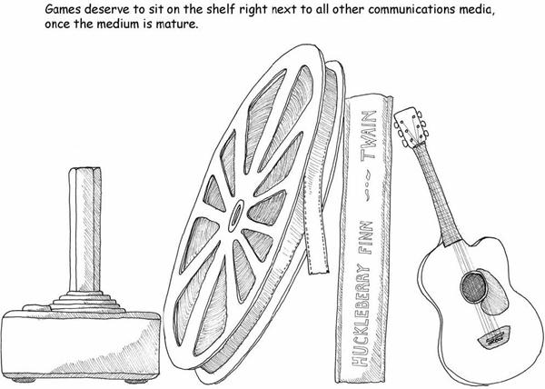
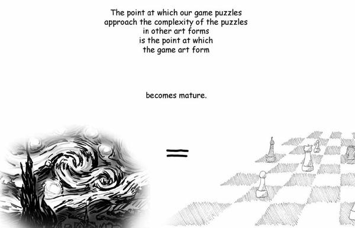
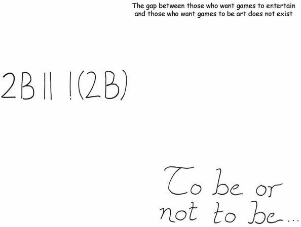
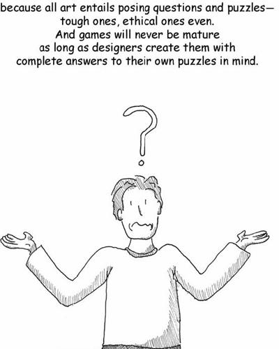
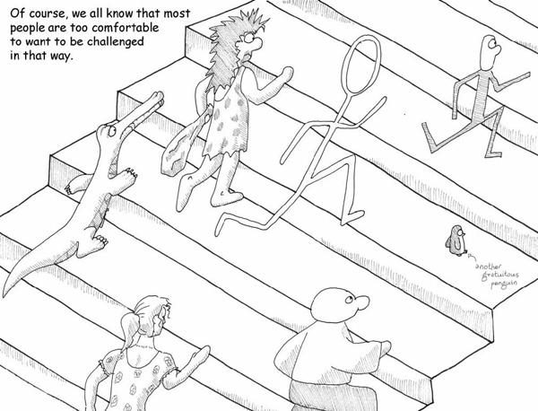
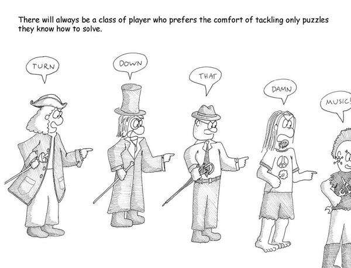
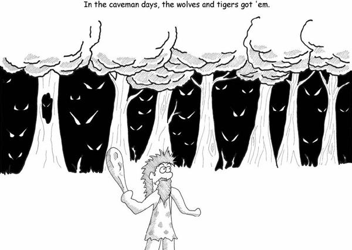

# 12. Taking Their Rightful Place

# Chapter 12. Taking Their Rightful Place

There are games that accomplish this—the work of Dani Bunten Berry comes to mind. But far too many games do not do so with conscious intent. Games have the capability to sit on the shelf next to all other communications media. They are capable of art. They are capable of portraying the human condition. They are teaching tools. They carry socially redeeming content. They elicit emotion.

But we have to *believe* that they do, in order for them to reach their potential. We have to go into the systems design process, the ludeme-building process, aware that they have this potential and this capability. We have to consider ourselves as artists, as teachers, as people with a powerful tool that can be taken up.

It’s time for games to move on from only teaching patterns about territory, aiming, timing, and the rest. These subjects aren’t the preeminent challenges of our day.

Games do not need to be able to evoke an unexpected tear, like the *Pietà*.

Games do not need to be able to rouse us to anger against injustice, like *Uncle Tom’s Cabin*.

Games do not need to be able to send us spiraling into awe, like Mozart’s *Requiem*.

Games do not need to leave us hovering at the boundary of understanding, like Duchamp’s *Nude Descending a Staircase*.

Games do not need to record the history of our souls, like *Beowulf*.

They may not be able to, in fact. We would not necessarily ask architecture or dance to accomplish all of those things either.

But games *do* need to illuminate aspects of ourselves that we did not understand fully.

Games do need to present us with problems and patterns that do not have one solution, because those are the problems that deepen our understanding of ourselves.

Games do need to be created with formal systems that have authorial intent.

Games do need to acknowledge their influence over our patterns of thought.

Games do need to wrestle with the issues of social responsibility.

Games do need to attempt to apply our understanding of human nature to the formal aspects of game design.

Games do need to develop a critical vocabulary so that understanding of our field can be shared.

Games do need to push at the boundaries.

Most importantly, games and their designers need to acknowledge that there is no distinction between art and entertainment. Viewed in context with human endeavor and what we know of how our inner core actually *works*, games are not to be denigrated. They are not trivial, childish things.

In no other medium do the practitioners assume that just because they’re paying their dues, they cannot create something capable of changing the world. Nor should game designers.

All art and all entertainment are posing problems to the audience. All art and all entertainment are prodding us toward greater understanding of the chaotic patterns we see swirl around us. Art and entertainment are not terms of *type*—they are terms of *intensity*.

Why? Because people are lazy, yet people also want a better life for their children. That is the blind urge that drives all humanity, all life. A legacy is what motivates the selfish genes embedded in the warp and weft of our bodies.

Let’s be frank with ourselves. We all know that most people, most of the audience out there, is complacent. They are very willing to settle for easy entertainment. They are more than up for another evening in the Barcalounger in front of a sitcom that teaches the same lessons that the one on last week did.

We call this “pop music.” We call it “mass market.” And games are indeed reaching for this mass market, and I suppose that to a degree I am fighting in the tide in arguing that that is not the ultimate destiny for games any more than it is for any other art form. The art we remember is material that opened up new vistas; whether or not it was popular at the time is largely an accident of history. Shakespeare was a popular playwright and then was forgotten for a couple hundred years. Popularity is not a measure of long-term evolutionary success.

A tremendous amount of the content pumped through media today has as its goal mere comforting, confirming, and cocooning. We gravitate toward the music we already like, the morals we already know, the characters who behave predictably.

Seen in the most pessimistic light, this is irresponsible. When the world shifts around those people, they will lack the tools to adapt. The calling of the creator is to provide those people with the tools to adapt, so that when the world changes and is swept along the currents of cultural change, those folks in the Barcaloungers are swept along with them and the march of human advancement continues.

Play developed to teach us about survival. For many cultural reasons, we have allowed it to take a place in human culture where it is denigrated, minimized, and assumed to be worthless. And yet there’s a cultural undercurrent that operates at the instinctive level, an under-current that mourns the ways in which play is removed from our lives.

Games mattered to us in prehistoric days. It may be that we’ve outgrown the simplistic lessons they were able to teach and that, when we reach adulthood, we do in fact put aside childish ways.

But my kids are showing me that childhood is also a state of mind. It is an ongoing quest for learning.

I, for one, don’t want to put that aside, and I don’t think anyone else should either.

In the end, if I can say with a straight face after a day’s work making games that one person out there learned to be a better leader, a better parent, a better co-worker; learned a new skill that kept them their job, a new skill that helped them advance the state of the art in their chosen field, a new skill that made their world grow a little…

Then I will know that my work was valuable. It was worthwhile. It was a contribution to society.

I’ll be able to whisper to myself, “I do connect people.”

“I do teach.”

Hear that, grandpa?

> I MAKE GAMES, AND IM PROUD OF IT.

