# A. Epilogue: Fun Matters, Grandpa

# Appendix A. Epilogue: Fun Matters, Grandpa

It’s been a long journey for me, and I don’t doubt that as my kids continue to grow, it will seem even longer.

I have watched them start to learn the concepts of respect for one another.

I have watched them understand that resources are limited and that things must be shared.

Every day, they connect an astounding number of new neurons; they learn a flabbergasting number of new words, and they develop in ways I can barely remember and barely glimpse.

Games are helping them along that path, and for that I am grateful. I’m not immune to the desire that my children be better off, after all, and I’ll take any tool that helps us along that path.

A lot of old age is attributable to losing neurons, losing connections, losing the patterns we have built up, settling into fewer and fewer until all we can do is stand by helplessly as the world dissolves into noise around us. We’d all be better off if we kept our minds limber by pushing them to always tackle new problems.

Not too long before my grandfather died, he told me, “I’m thinking of getting one of those computer things. It doesn’t seem like the Internet is all that different from ham radio. Maybe I’ll give it a try.”

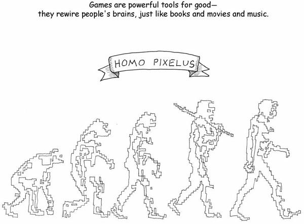

I learned of my grandfather’s passing when I arrived at the hotel in San Jose, where I was attending the annual Game Developers Conference. Somehow it seems apropos.

The questions he posed, there in the wake of shootings at Columbine High School, there at a time when the world was suddenly making little sense, are fair questions.

Are games a tool for evil? Or for good? Are they frivolous at best or frivolous at worst?

It seems important that we know the answers, not just to allow those of us who work in this field to sleep better at night, but also in order to reassure those who watch us work: our families, our friends, our cultures.

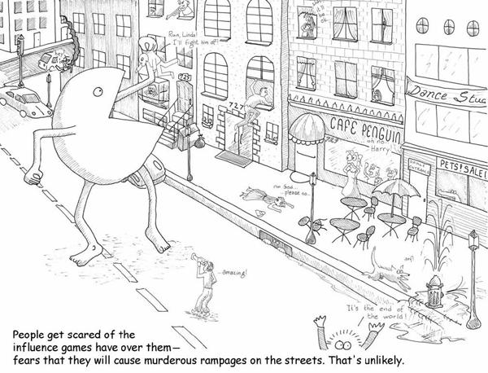

Games fit in the spectrum of human activity. Human activity is not always pretty. It’s not always noble. It’s not always altruistic. And a lot of really dumb things are done in games. A lot of dumb things are done by people playing games. A lot of dumb things are done by those making games.

But ignorance can be rectified. Human activity may be driven by selfish genes, by the phantasms of inaccurate perception, by reactionary tribalism and shortsighted dominance moves.

But there are those firemen, those special education teachers, those architects, who are out there working. They’re building spaces in which we can live safely and rear our children.

I’ve put forth what may seem like a mechanistic view of the world in this book, one that would perhaps run contrary to my grandfather’s deeply held religious faith. And yet I think that we would both come to the same conclusion:

Any striving for understanding that we do is likely to hold back the darkness. The new may scare us, as when symphonies with odd harmonies cause riots among disturbed music lovers…

But time smoothes things over. And we are left with beautiful music.

So my answer here is, I am willing to choose which side of human nature I want to foster.

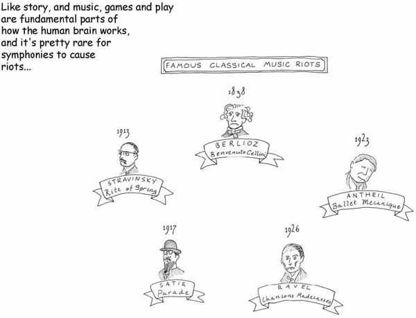

I cannot blame my grandfather for being nervous about something that seemed very new, even though it was in fact very old. It is a natural reaction. It is the human reaction to the eruption of the unfamiliar.

Tracing the nature of fun, and the core of gameplay, has made me more comfortable in my own self with what I do, and why I do it.

We have a powerful tool here, one that is arguably underutilized even as it reaches new peaks of acceptance among people of all ages. We should take it up responsibly, with awareness of how it fits into culture, and with respect for its abilities.

The mere titling of a piece of music lends it narrative context and enriches it tremendously. Yes, it is possible to appreciate Penderecki’s *Threnody for the Victims of Hiroshima* or any of the works of Aaron Copland without their titles, as pure sound. But the *sense* of them is carried in the interstices between the music and the title. Just as the *sense* of a film is carried in the webbing between the acting and the writing and the cinematography.

Other art forms have long recognized this; Welles’s staging of *Macbeth* as a Haitian tale of vodoun, for example, achieved by selectively adjusting one of the component pieces of the art form.

All of which is by way of saying that I don’t think we get to ignore the prostitutes, the sexism, the occasional racism, and the general crudity of the commercial game industry. The prostitute in *Grand Theft Auto* may be a power-up in mechanical terms. But in experiencing the game, it takes a game critic to divorce her from the context in which she appears. And frankly, game critique isn’t even developed enough to give that particular game object and interaction a name.

My answer here is, I’m content with accepting my responsibility on that front.

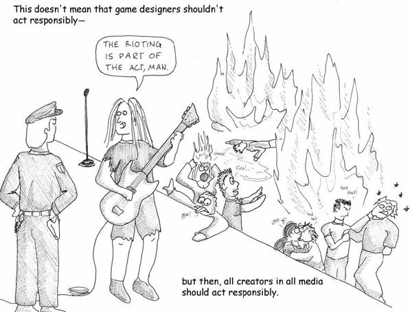

If games are mere amusements, and my grandfather’s concerns were valid, then by acting responsibly, and striving to make games that illuminate the human condition, I have at least caused no harm.

If I am going to noodle about with this medium simply because I think it’s a nifty keen toy, the *least* I can do is make sure I don’t hurt anyone else in the process. Even better, I can take this nifty keen toy very very very seriously and assume that it is a powerful tool for good or evil. And try to make it a tool for good.

It’s Pascal’s Wager. If it’s all “just a game,” I was just a crackpot all along. But if it’s not…. There are only two responsible ways to behave with such a tool. Either step away from it altogether and let someone qualified take it up, or take it up and be as qualified as you can.

My reply is, I won’t take a sucker bet.

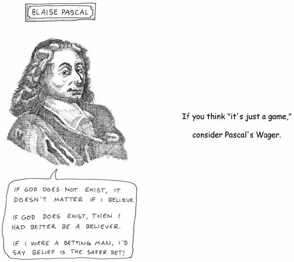

The task I have to make my grandfather proud of what I do seems fairly simple, really. It’s not that dissimilar to the role he took up each time he picked up his carpentry tools in his workshop.

Work hard on craft.

Measure twice, cut once.

Feel the grain; work with it, not against it.

Create something unexpected, but faithful to the source from which it sprang.

Strikes me as good advice for any act of creation. My reply is, I can do that.

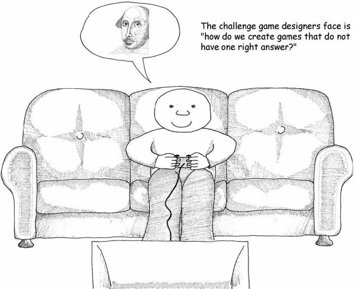

My kids already play games and say things and do things that make me uncomfortable, just as I made games that made my grandfather uncomfortable. Some eggs need to be broken to make this omelet.

To achieve the potential of the medium, we’re going to have to push at some boundaries and on some buttons that may make people rather uncomfortable. We’ll assert that games are not only entertainment, and we will probably produce some work that may shock, or offend, or present themes that challenge deeply cherished beliefs.

That’s not outlandish. All the other media do it.

My commitment is, I’ll try to make sure that nobody gets hurt.

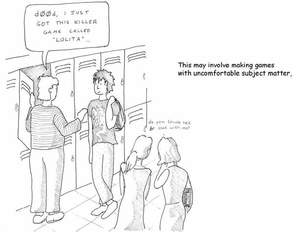

For all of us game designers, it means the extremely difficult task of reevaluating our roles in life. It means perceiving ourselves as having a responsibility to others, whereas we previously thought of ourselves as carefree. It means granting a greater level of respect to the tools we work with—the push and pull of mechanic and feedback, the intricate pathways of the human brain and human apprehension—and a greater level of respect to our audience.

They deserve more than just another jumping puzzle. We have to believe, as game designers, that we can deliver that, and we have to believe that we *should*.

To which I say, I believe.

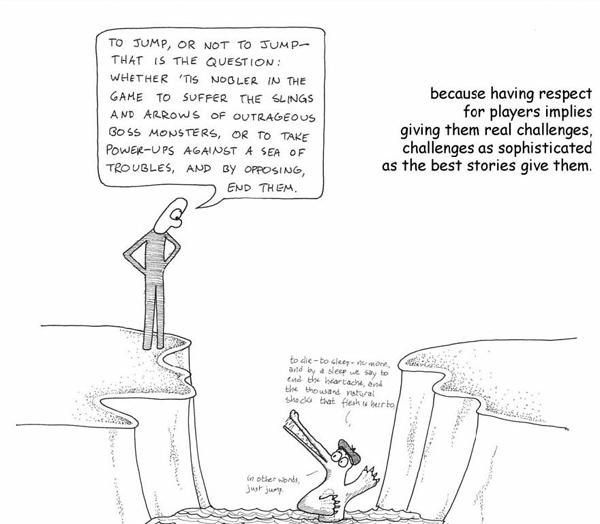

Last, it means that everyone else—the people like my grandfather—need to come to understand the valuable role we play in society. We’re not geeks in the basement rolling funny-shaped dice. We’re also the teachers of your children. We’re not irresponsible 14-year-old boys (well, not all of us)—we’re parents too. We’re not splattering gore and sex on TV screens across the world merely for the sake of titillation.

Games deserve respect. We as creators must respect them, and do right by their potential. And the rest of the world must respect them and grant them the scope to become what they can and must.

So my answer is, yes, what we do is worthy of respect.

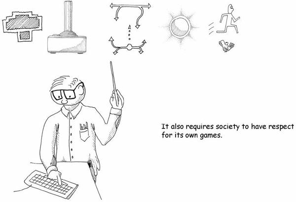

It may be that even after everything I’ve said, everything all the other people working with games have said, society will continue to react in a knee-jerk fashion to the unfamiliar.

It may be that the current flowering of academic programs in game studies, and the fledging field of ludology, are an aberration and a frivolity.

But painting was once a blasphemous act that robbed reality of its essence. Dance was seen as wantonness incapable of expressing any higher emotions. The novel was self-indulgent gothic nonsense for cooped-up housewives. Film was once trashy kinetoscopes at the penny arcade, unworthy of adult attention. Jazz was devil music that would lead young lives astray. Rock ‘n’ roll was destroying the fabric of our country.

And Shakespeare himself was no more than a bit player and sometime scribbler for a theater in the bad part of town. Proper women weren’t allowed because their reputations would be ruined, and their stepping on the stage was unthinkable.

We learned better.

It’s still possible that this time we won’t…

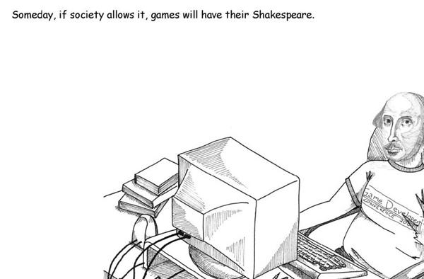

in which case we should pack up all the chess sets…

gather up the balls and the nets and the tops…

collect the dolls and the toy cars…

put them in that chest, the one at the top of the stairs…

the one we carry up to the attic…

to sit closed, hasp flipped but not locked, under the window…

We should put away the things of childhood and step into a world where the young, and the young at heart, are seen and not heard.

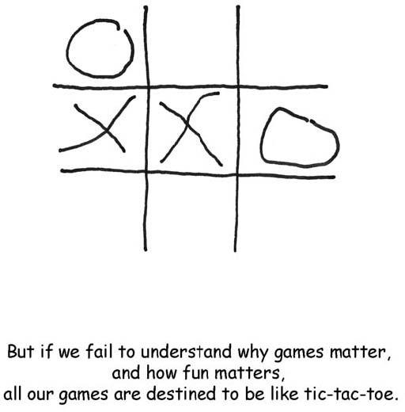

To which I say,

No.

Because I’d hate to pass up that look of joy and wonder in my children’s eyes.

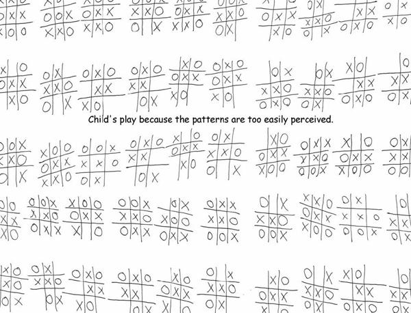

