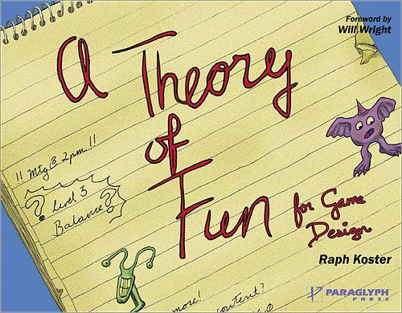

# C. What Readers are Saying About Raph Koster’s Theory Of Fun:

# Appendix C. What Readers are Saying About Raph Koster’s Theory Of Fun:

|  |  |  |
| --- | --- | --- |
|  | “This book convincingly answers the question,“What makes a game fun? And more than that, it dives into topics such as the ethics of games and how games can take their rightful place alongside other respected forms of entertainment. It’s all good stuff, and it’s easy to agree with everything Koster writes. It all rings true.  Koster has written one of the best books for our industry. I hope everyone adds it to their bookshelf.” |  |
|  | -- Scott Miller | |

|  |  |  |
| --- | --- | --- |
|  | “Raph Koster’s *A Theory of Fun for Game Design* is certainly a book worthy of a place on any game designer’s shelf. Raph has written a light, frequently humorous, and sometimes touching book that should make a great gift to those of us who have parents or spouses who DON’T understand why we’re wasting all of our time with games. Rather than try to explain it to them, you can simply hand them this book.” |  |
|  | -- Bruce Woodcock | |

|  |  |  |
| --- | --- | --- |
|  | “Entertaining, thoughtful, an excellent job.” |  |
|  | --Slashdot | |

|  |  |  |
| --- | --- | --- |
|  | “Every once in a while a short and simple book comes along that manages to describe a really huge concept that applies to numerous aspects of life. I’m not sure if the author intended to, but when you scrutinize this book I found more applicable thoughts and views than I did while looking through Confucius.” |  |
|  | --Theis Egeberg, Denmark | |

|  |  |  |
| --- | --- | --- |
|  | “Entertaining and innovative… a wide-ranging intellectual foray into what games mean.” |  |
|  | --[BlogCritics.org](http://BlogCritics.org) | |

|  |  |  |
| --- | --- | --- |
|  | “This book not only is an entertaining read, but also presents a vocabulary of valuable tools for game developers across all media. So many books are written these days on the techniques of designing games. But without understanding *why* we play games, all that technique is meaningless.” |  |
|  | -- Scott Tengelin | |

|  |  |  |
| --- | --- | --- |
|  | “It’s a book I sincerely believe everyone should have read at least once in their lifetime. It’s that important… what Campbell and Vogler did to storytelling, Koster has done to *play*. This is a seriously important work. It’s a pop-science book that makes use of the very theory it espouses. And it works. It works exceptionally well. By the time you’ve read through it, so many pieces of the game design puzzle will have clicked together in your head that you’ll sit there wondering how someone could get so much knowledge across in such an easily swallowed pill… This book is history in the making. It will be referred to in seminal books whose authors have not yet even been born.” |  |
|  | --[GameDev.net](http://GameDev.net) | |

|  |  |  |
| --- | --- | --- |
|  | “Thankfully, *A Theory of Fun* exceeded my expectations on all levels. It has the accessibility of *Understanding Comics*, having a narrative depicted in images on every other page. But it also has the depth, having the text to go along with it all, unlike *Understanding Comics*. It’s thoroughly researched and well written. Best of all it gives good solid insights. You come out knowing more and being able to think about things in new and interesting ways. Although it is all firmly based around games, the book jumps through many disciplines—mathematics, psychology, art, and so forth. When the author touches on complex items, he cuts to the chase about how it’s applicable to the subject matter. In summary, I think it’s an excellent book and an instant classic.” |  |
|  | --Jonathan, from Bookham, Surrey, UK | |

|  |  |  |
| --- | --- | --- |
|  | “It is an insightful read from a thoughtful industry insider, and equally notable, it is provocative for the questions it raises.” |  |
|  | --[terranova.blogs.com](http://terranova.blogs.com) | |

|  |  |  |
| --- | --- | --- |
|  | “I’m really glad that you wrote this! Everyone from professional game developers to those who want to understand why we play games will enjoy *A Theory of Fun*. You’ve written a wonderful starting point for research and many future dinner conversations!” |  |
|  | -- Cory Linden Lab Ondrejka | |

|  |  |  |
| --- | --- | --- |
|  | “Koster tries to describe why a computer game is enjoyable, or at least what makes the successful ones so. En route, he gives an informal synopsis and taxonomy of the games that have appeared since the 1970s—the seminal Space Invaders, Pac Man, Defender, Tempest, and others from your misspent youth. (Well, mine anyway.) Ambitiously, he tries to put games into a broader context, comparing them to other communications media, like music, books, and movies. He craves intellectual respectability for games, on a par with those activities, for which academic analysis is now commonplace. Koster suggests that with now over 20 years of gaming, it is likewise time for games to be regarded seriously.” |  |
|  | -- Dr.. Wes Boudville | |

|  |  |  |
| --- | --- | --- |
|  | “I’ll never look at game design in quite the same way again.” |  |
|  | --[Grimwell.com](http://Grimwell.com) | |

|  |  |  |
| --- | --- | --- |
|  | “This entertaining and innovative book is ostensibly for game designers. Personally, I think it is more than that: it’s a primer for anyone interested in games, both for how they work and what we think of them. Written by Raph Koster, the chief creative officer for Sony Online Entertainment, it isn’t an artificial or inflated study in how to build a particular kind of game. Instead, it is a wide-ranging intellectual foray into what games mean, both to individuals and society, and how they operate on a host of different levels.” |  |
|  | --[Wallowworld.com](http://Wallowworld.com) | |

|  |  |  |
| --- | --- | --- |
|  | “A thoughtful and entertaining book that distills years of experience and research from a great and practical game designer. Koster explores the fun of games from many angles such as personal experience, academic research, anecdotes, and cognitive neuroscience. The core of the book establishes the role of games, why games are fun or boring, the elements of beauty and delight, and the beginnings of a framework for the critical analysis of video games. Along the way, Koster provides a justification for video games as practical teaching tools, a viable and important medium for art, and a legitimate part of our culture.  The writing style makes it approachable to casual readers or game designers. Every other page is a thoughtful cartoon, interwoven with the rich text. This makes it read like two books carefully spliced together—in a good way. As a software professional working in the industry, I especially appreciated the comprehensive end notes.” |  |
|  | -- Patrick McCuller | |

|  |  |  |
| --- | --- | --- |
|  | “You should buy the book immediately.” |  |
|  | -- Dr.. Richard Bartle | |

|  |  |  |
| --- | --- | --- |
|  | “This is the only book in a life of ‘tube’ reading that a stranger has stopped me to ask what I was reading. It is the Gita of gaming.” |  |
|  | -- Jason Cason | |

|  |  |  |
| --- | --- | --- |
|  | “A great book that explores what is necessary and sufficient for a game (particularly video games) to be fun. His premise is that the fun most associated with games is the enjoyment gained from learning how to play the game, and learning how to better play the game. Games are so good at conveying this fun because they are little sandboxes; the player doesn’t have to worry about dying, so they’ll be able to explore more exciting (and dangerous) worlds than are possible in the real world.” |  |
|  | -- David Ganzhorn | |

|  |  |  |
| --- | --- | --- |
|  | “I’ve handed out close to 15 copies of this book so far…” |  |
|  | -- Paul Stephanouk *Big Huge Games* | |

[*OceanofPDF.com*](https://oceanofpdf.com)

# About the Author

Raph Koster (San Diego, CA) is the Chief Creative Officer for Sony Online Entertainment and author of the bestselling book, A Theory of Fun for Game Design. For many years he has served as a lead designer for teams building online virtual worlds. His first job was as a designer working on persistent worlds at Origin Systems. His last project there was working on Ultima Online, opening the online persistent world market to the general gaming public.

[*OceanofPDF.com*](https://oceanofpdf.com)

[*OceanofPDF.com*](https://oceanofpdf.com)
